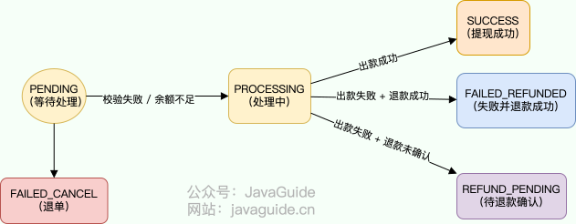
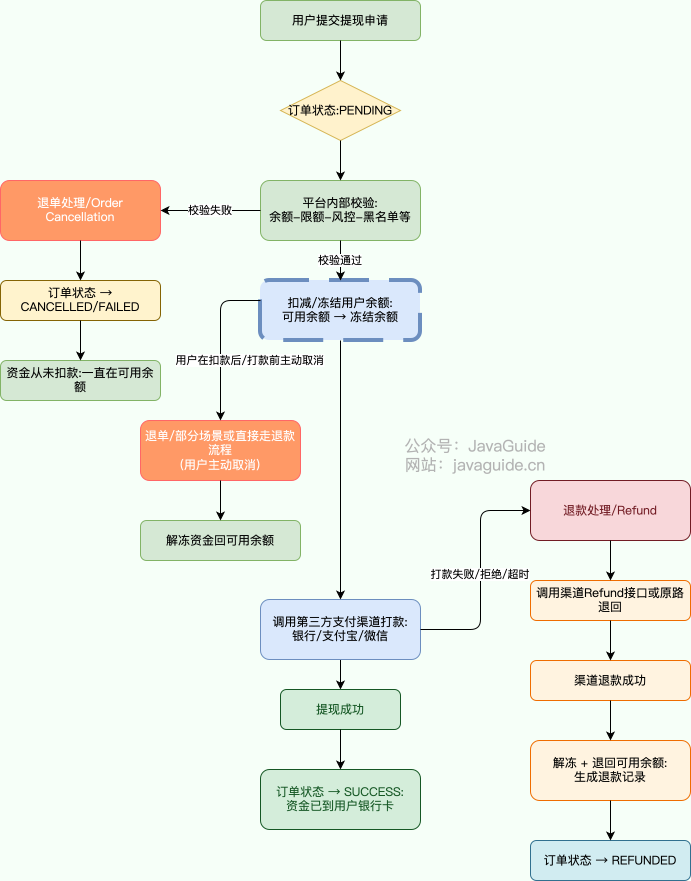
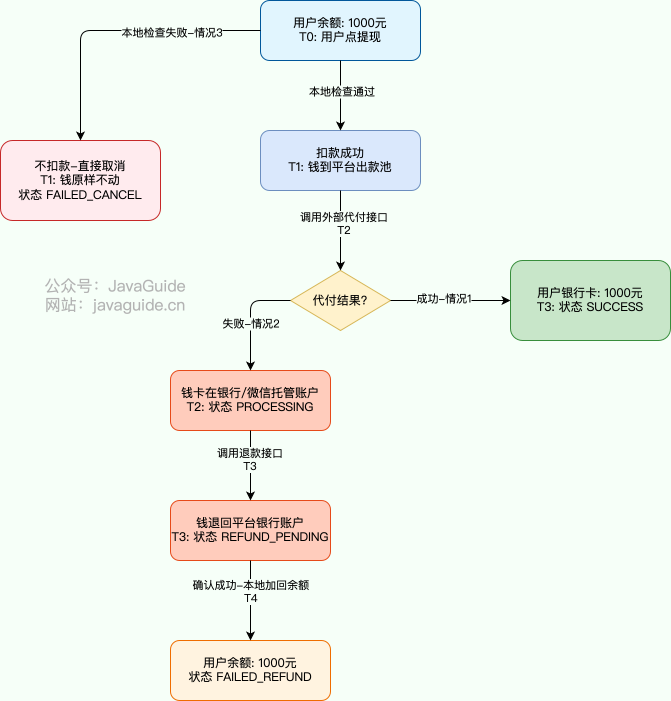

# 发生提现失败（退单）时怎么处理？

这类“**提现失败处理（退单 vs 退款）**”的场景题，**本质上是对系统可靠性、资金安全、最终一致性和分布式事务处理能力的考察**，是中高级后端工程师面试中**很常见的业务架构题型**。如果你是校招面试的话，可以跳过这道题目，除非你的项目涉及到了支付相关的内容或者单纯感兴趣。

类似的面试题还有：

1. 用户付款成功了，但商户没收到通知，怎么办？
2. 用户申请退款时，如何确保资金安全和状态一致？
3. 如果退款接口被重复调用，如何避免用户多次收到钱？
4. 请为提现订单设计一套状态机，考虑各种失败路径

下面是开始正文。

在支付与账务系统中，**“提现”**（Withdrawal）是最敏感的环节。入金失败顶多是用户付不进来钱，而出金（提现）失败如果没有处理好，轻则导致用户资产“凭空消失”引发投诉，重则引发严重的资金损失或监管合规问题。

本文将深入探讨提现失败时的两种核心处理模式：**退单（Cancellation）与退款（Refund）**，并提供一套基于 Java + 消息队列的生产级处理方案。

## 退单和退款的区别？

很多初级开发者容易混淆这两个概念，导致代码逻辑混乱。区分它们的唯一金标准是：**资金是否已经真正离开了我们的平台体系？**

* **退单（Order Cancellation 或 Refund Order）**：
  * 含义：对提现订单的整体撤销，通常在交易未进入资金转移阶段时使用。相当于取消订单，将其状态标记为无效，资金不发生实际变动（或回滚到原账户）。
  * 适用场景：提现失败发生在平台内部时，如校验失败或用户取消。退单更侧重订单层面的清理，不涉及外部渠道的资金操作。
  * 特点：操作简单，主要更新数据库状态（如从“PENDING”到“FAILED\_CANCEL”），无资金流动记录。适用于预防性处理，避免不必要的渠道调用。
  * 示例：在 Java 系统 中，如果提现金额校验失败，直接退单，资金留在用户余额中。
* **退款（Refund）**：
  * 含义：逆向资金操作。资金已经从用户账上扣除，并且请求已经发到了第三方渠道，但渠道告知失败（或超时），需要把钱“追回来”。
  * 适用场景：提现失败发生在渠道侧时，如银行拒绝。退款是资金层面的操作，必须生成独立的退款记录。
  * 特点：涉及真实资金流动，可能有手续费和时效（如即时或 T+1 到账）。需确保对账一致，符合监管要求。
  * 示例：资金已扣除但银行卡无效，则发起退款，将钱退回平台余额。

**关键区别对照表：**

| **维度** | **退单 (Cancel)** | **退款 (Refund)** |
| --- | --- | --- |
| **资金位置** | 还在平台体系内 | 已提交至外部渠道（或托管账户） |
| **发生时机** | 提现请求初期（前置校验阶段） | 提现请求后期（渠道交互阶段） |
| **处理复杂度** | 低（本地数据库事务） | 高（分布式一致性，需对账） |
| **外部交互** | 无 | 有（需解析渠道错误码） |

## 提现失败在业务中会遇到吗？

非常常见。在电商或理财等资金类系统中，提现失败并不少见；按业务经验，失败率通常在 **0.1%–2%**，在高峰期、渠道波动或风控收紧时可能更高。若处理不当，影响往往比较严重：

* **客诉激增**：用户看到“余额已扣/冻结”，但迟迟未到账，体验直线下降。
* **长短款（错账）**：平台侧与渠道侧资金/账务状态不一致（例如平台已扣款但渠道未成功出款，或渠道已出款但平台未落账）。
* **合规风险**：资金处理不规范可能触及备付金管理与对账留痕等合规要求，带来审计与监管压力。

## 发生提现失败的原因有哪些？

| **责任方** | **概率** | **典型原因** | **最终处理** |
| --- | --- | --- | --- |
| **平台内部** | 30% | 数据库抖动、并发扣款 Bug、风控拦截（金额超限/黑名单） | **退单** |
| **用户侧** | 30% | 银行卡号填错、姓名不符、账户被冻结、超过银行限额 | **退款** |
| **渠道侧** | 30% | 银行系统维护、API 签名错误、网络超时无响应 | **退款** |
| **不可抗力** | 10% | 监管政策变更、DDoS 攻击 | **视情况而定** |

这些原因可能相互叠加，有时会导致原本的退单场景升级为退款。

## 订单状态设计与流转

提现过程中可能出现的订单状态包括：

* `PENDING`: 用户发起提现请求，等待处理
* `PROCESSING`: 平台已冻结余额，准备出款
* `SUCCESS`: 打款成功，用户收到了钱
* `FAILED_CANCEL`: 平台校验未通过，退单处理
* `REFUND_PENDING`: 打款失败，等待退款确认
* `FAILED_REFUNDED`: 打款失败 + 退款成功，已退回余额

为了更直观理解状态之间的转移关系，见下图：

## 

## 如何正确的处理提现失败的问题呢？

### 从业务角度看一下退单和退款的资金流向

| 场景 | 钱有没有离开“我们体系” | 钱现在在哪 | 正确处理方式 | 错误做法 |
| --- | --- | --- | --- | --- |
| 退单（Cancel） | 没有离开 | 还在用户平台余额（MySQL balance 表）里 | 纯本地事务，改状态即可 | — |
| 退款（Refund / 退汇） | 已经离开 | 在银行/微信/支付宝的托管账户里 | 必须先调外部退款接口要回钱，再本地加余额 | 直接本地加余额 → 资金多出 → 对账差额 → 监管罚款 |

### 从业务角度看一个完整的用户提现的流程图



### 正确的处理提现失败的问题

**失败场景汇总：**

| 失败时机 / 失败原因 | 是否已经扣余额 | 正确处理方式 | 最终订单状态 | 属于退单还是退款 |
| --- | --- | --- | --- | --- |
| 余额不足 | 否 | 直接拒绝，不创建订单或创建后立即标记 | FAILED / FAILED\_CANCEL | 退单（根本没扣钱） |
| 风控拦截（黑名单、异常交易等） | 否 | 同上 | FAILED\_CANCEL | 退单 |
| 本地扣款失败（DB 异常、并发扣款超时等） | 否 | 事务回滚，订单标记 | FAILED\_CANCEL | 退单 |
| 本地扣款成功，但发 Kafka 前 JVM 挂了 | 是 | 定时任务扫描 PROCESSING 超时的订单 → 走正常出款/退款逻辑 | 最终 SUCCESS 或 FAILED\_REFUNDED | 退款（必须把钱还回去） |
| 发完 Kafka 后，消费者还没消费就挂了 | 是 | 同上，定时任务补 | 同上 | 退款 |
| 代付接口返回明确失败（姓名不符、超限额、银行维护、卡号冻结等） | 是 | 立即调用退款接口（或标记退款），成功后加余额 | FAILED\_REFUNDED | 退款 |
| 代付接口超时 / 未知（网络抖动、渠道无响应） | 是 | 标记为 PENDING / OUTPAY\_UNKNOWN，定时任务轮询查结果    查到成功 →SUCCESS    查到失败 → 走退款 | 最终 SUCCESS 或 FAILED\_REFUNDED | 退款 |
| 退款接口也失败或超时 | 是 | 标记 REFUND\_PENDING，定时任务反复查询退款结果 | 最终 FAILED\_REFUNDED（极少数转人工） | 退款 |

**那我们该如何在代码中处理呢？** 核心原则：

* 本地先扣余额（保证钱不会丢）
* 绝不在事务里调用第三方（防分布式事务）
* 全靠 Kafka + 定时任务保证最终一致性
* 一切自动化，无需人工干预

标准流程（4 步）：

1. 发起提现（同步）
   * 扣用户余额成功
   * 订单状态 → PROCESSING
   * 发一条 Kafka 消息，自己立刻返回“处理中”
2. 异步出款（Kafka 消费者）
   * 调用支付渠道真正打款
   * 成功 → 订单 SUCCESS，异步推用户通知
   * 失败 →
     * 还能重试 → 重试次数+1，再发一条消息进 Kafka（延迟重试也行）
     * 没次数了 → 调用渠道「退款到余额」（幂等），成功后加回余额，订单 FAILED\_REFUNDED
3. 定时补偿任务（两类，每 5 分钟跑一次）
   * 补偿 1：找出 PROCESSING 超时的订单 → 再发消息或直接重试
   * 补偿 2：找出退款中（REFUND\_PENDING）的订单 → 查渠道实际状态，没到账继续等，到账就加余额
4. 用户通知（全部异步）
   * 成功、失败、已退款，都走消息队列发站内信/推送/短信

提现 Demo 代码,仅供参考,核心实现思想。

```java
@Entity
@Table(name = "withdrawal_order")
@Data
public class WithdrawalOrder {
    @Id @GeneratedValue(strategy = GenerationType.IDENTITY)
    private Long id;

    private Long userId;
    private BigDecimal amount;
    private String status;                         // PENDING / PROCESSING / SUCCESS / FAILED_CANCEL / FAILED_REFUND / REFUND_PENDING
    private String failReason;

    private int retryCount = 0;                         // 新增：代付重试次数
    private int maxRetry = 3;                           // 最多重试3次（含第一次）

    @Column(columnDefinition = "datetime(3)")
    private LocalDateTime updateTime = LocalDateTime.now(); // 用于超时判断

    @Version
    private Integer version; // 乐观锁
}
```

```java
@Service
@RequiredArgsConstructor
@Slf4j
public class WithdrawalService {

    private final WithdrawalOrderRepository repo;
    private final BalanceService balanceService;
    private final PaymentGateway gateway;
    private final KafkaTemplate<String, WithdrawalOrder> kafka;

    // ====================== 1. 提现入口 ======================
    @Transactional
    public void initiate(Long userId, BigDecimal amount) {
        WithdrawalOrder order = new WithdrawalOrder();
        order.setUserId(userId);
        order.setAmount(amount);
        order.setStatus("PENDING");
        repo.save(order);

        try {
            balanceService.deduct(userId, amount);           // 本地扣款
            order.setStatus("PROCESSING");
            order.setRetryCount(0);                          // 初始化重试次数
            order.setUpdateTime(LocalDateTime.now());
            repo.save(order);

            kafka.send("withdrawal-topic", order);           // 异步出款
        } catch (Exception e) {
            order.setStatus("FAILED_CANCEL");                // 退单
            repo.save(order);
            log.warn("提现退单 orderId={}", order.getId(), e);
        }
    }

    // ====================== 2. 正常异步消费者 ======================
    @KafkaListener(topics = "withdrawal-topic")
    public void handle(WithdrawalOrder msg) {
        WithdrawalOrder order = repo.findById(msg.getId()).orElse(null);
        if (order == null || !"PROCESSING".equals(order.getStatus())) {
            log.warn("丢弃脏消息 orderId={}", msg.getId());
            return;
        }
        processOutPayment(order);
    }

    // ====================== 3. 核心处理（代付 + 退款） ======================
    @Transactional
    public void processOutPayment(WithdrawalOrder order) {
        try {
            String result = gateway.withdraw(order);    // 真正打钱给银行卡

            if ("SUCCESS".equals(result)) {
                order.setStatus("SUCCESS");
                repo.save(order);
                notifyUser(order, "提现成功");
                return;
            }

            // 代付失败 → 看还能不能重试
            if (order.getRetryCount() < order.getMaxRetry()) {
                order.setRetryCount(order.getRetryCount() + 1);
                order.setUpdateTime(LocalDateTime.now());
                repo.save(order);
                log.info("代付失败，第{}次重试，orderId={}", order.getRetryCount(), order.getId());
                // 再次扔回 MQ 队列，让消费者稍后再试（或直接等补偿任务扫）
                kafka.send("withdrawal-topic", order);
                return;
            }

            // 重试次数已用完 → 走退款流程
            log.warn("代付重试{}次仍失败，发起退款 orderId={}", order.getMaxRetry(), order.getId());
            String refundResult = gateway.refund(order);
            if ("SUCCESS".equals(refundResult)) {
                balanceService.credit(order.getUserId(), order.getAmount());
                order.setStatus("FAILED_REFUND");
                repo.save(order);
                notifyUser(order, "提现失败，已退款到余额");
            } else {
                order.setStatus("REFUND_PENDING");
                repo.save(order);
            }

        } catch (Exception e) {
            log.error("代付异常 orderId={}", order.getId(), e);
            // 异常也算一次重试
            if (order.getRetryCount < maxRetry) {
                order.setRetryCount(order.getRetryCount() + 1);
                repo.save(order);
                kafka.send("withdrawal-topic", order); // 再试
            } else {
                order.setStatus("REFUND_PENDING");
                repo.save(order);
            }
        }
    }

    // ====================== 4. 补偿任务1：处理 PROCESSING 超时（崩溃兜底）======================
    @Scheduled(fixedRate = 300_000) // 5分钟一次
    public void compensateProcessingTimeout() {
        LocalDateTime timeout = LocalDateTime.now().minusMinutes(10, ChronoUnit.MINUTES);
        List<WithdrawalOrder> stuck = repo.findByStatusAndUpdateTimeBefore("PROCESSING", timeout);

        stuck.forEach(order -> {
            log.warn("发现 PROCESSING 超时订单 orderId={}，已超 {} 分钟，准备重试",
                     order.getId(), Duration.between(order.getUpdateTime(), LocalDateTime.now()).toMinutes());
            processOutPayment(order); // 直接走重试逻辑
        });
    }

    // ====================== 5. 补偿任务2：处理 REFUND_PENDING（退款轮询）======================
    @Scheduled(fixedRate = 300_000)
    public void compensateRefundPending() {
        List<WithdrawalOrder> pending = repo.findByStatus("REFUND_PENDING");
        pending.forEach(order -> {
            String status = gateway.queryRefundStatus(order);
            if ("SUCCESS".equals(status)) {
                balanceService.credit(order.getUserId(), order.getAmount());
                order.setStatus("FAILED_REFUND");
                repo.save(order);
                notifyUser(order, "提现失败，款项已退回余额");
            }
            // 不成功就继续等下一次轮询，最多保留7天，超期转人工
        });
    }

    private void notifyUser(WithdrawalOrder order, String msg) {
        // 发短信 / App推送 / 站内信
    }
}
```

## 总结,为何提现失败必须区分“退单“和“退款”?

三种典型情况：

1. **提现成功**（理想路径，80%概率）。
2. **提现失败，然后退款**（常见痛点，20%概率）。
3. **退单失败**（早期失败，扣款都没成功）。

### 情况 1：提现成功（一切顺利，用户开心）

用户点“提现 1000 元到银行卡”，系统全链路走通，钱直接到用户银行卡。

| 时间点 | 系统做了什么 | 资金在哪 | 订单状态 |
| --- | --- | --- | --- |
| T0 | 用户点“提现 1000 元到银行卡” | 用户平台余额：1000 元（还没动） | PENDING（待处理） |
| T1 | 系统本地扣用户余额（数据库操作） | 平台出款资金池：1000 元（钱从用户余额划到平台银行账户的“出款池”） | PROCESSING（处理中） |
| T2 | 系统调用外部接口（如微信企业付款到银行卡） | 钱从平台出款池转到银行/微信托管账户，再转给用户 | PROCESSING（处理中） |
| T3 | 外部接口返回成功，系统收到确认 | 用户银行卡：1000 元（到账） | SUCCESS（成功） |

**大白话**：钱像顺风车一样，从用户余额 → 平台出款池 → 银行 → 用户银行卡。全程没卡壳，用户直接看到到账通知。

### 情况 2：提现失败，然后退款（钱飞出去了，必须要回来）

扣款成功了，但打钱到银行卡失败（e.g., 卡号错、限额）。钱卡在中间，必须退款把钱要回平台，再加给用户。

| 时间点 | 系统做了什么 | 资金在哪 | 订单状态 |
| --- | --- | --- | --- |
| T0 | 用户点“提现 1000 元到银行卡” | 用户平台余额：1000 元（还没动） | PENDING（待处理） |
| T1 | 系统本地扣用户余额（数据库操作） | 平台出款资金池：1000 元（钱从用户余额划到平台银行账户的“出款池”） | PROCESSING（处理中） |
| T2 | 系统调用外部接口（如微信企业付款到银行卡） | 钱从平台出款池转到银行/微信托管账户，但转用户失败，卡在托管账户 | PROCESSING（处理中） |
| T3 | 外部接口返回失败，系统立即调用退款接口（如微信退款） | 钱从托管账户退回平台银行账户（外部确认成功） | REFUND\_PENDING（退款中） |
| T4 | 系统收到退款成功确认，本地加回用户余额 | 用户平台余额：1000 元（恢复原样） | FAILED\_REFUND（失败-已退款） |

**大白话**：钱像快递寄丢了——扣了但没到用户银行卡，卡在“银行仓库”里。系统必须再寄个“退货单”（退款接口）把钱要回来，才能安全加回用户余额。不这么做？平台亏 1000 元，用户投诉“钱没了”。

### 情况 3：退单失败（早期失败，钱根本没动）

失败发生在扣款前（e.g., 余额不足、风控拦截）。直接取消订单，钱原封不动。

| 时间点 | 系统做了什么 | 资金在哪 | 订单状态 |
| --- | --- | --- | --- |
| T0 | 用户点“提现 1000 元到银行卡” | 用户平台余额：1000 元（还没动） | PENDING（待处理） |
| T1 | 系统检查余额/风控，但失败（e.g., 余额只有 900 元） | 用户平台余额：1000 元（没扣成功） | FAILED\_CANCEL（失败-已退单） |
| T2 | 系统不调用外部接口，直接取消订单 | 用户平台余额：1000 元（原样） | FAILED\_CANCEL（失败-已退单） |

**大白话**：钱像还没出门就发现“没带钥匙”——扣款都没开始，直接取消。用户看到“提现失败，请检查余额”，钱稳稳躺在原地。

### 真实资金路径图



## 面试题

### 什么是退单和退款的区别？在提现失败中，如何选择？

退单和退款的区别，主要看钱有没有真正从咱们系统里扣走。

1. 退单呢，就是钱还没动，比如余额不够或风控卡住，这时候简单改改数据库状态，从 `PENDING` 变成 `FAILED_CANCEL` 就行，不用调外部接口。
2. 退款是钱已经扣了，但打到银行失败了，得调用外部 API 把钱追回来。
3. 选择的话：没扣钱就退单，扣了但没成功就退款，这样数据才不会乱。

### 系统在扣款成功后但外部调用前崩溃，如何处理？偿？

1. 用定时任务（比如 `@Scheduled`每 5 分钟扫一次）找 `PROCESSING` 的订单，然后重跑 `processOutPayment`（代付&退款）方法，要么重试出款，要么退款，最终变成 `SUCCESS` 或 `FAILED_REFUNDED`。
2. 为什么需要这个？因为系统崩溃是常事，定时补偿保证最终一致性，不用人工干预，自动兜底，避免数据不一致。

### 描述完整提现失败流程，包括异步和重试。为什么不在事务中调用外部接口？

整个流程分成4步：

1. 先同步部分，用 `@Transactional` 扣余额，成功就改状态 `PROCESSING`，发 Kafka 消息，返回‘处理中’；扣失败直接 `FAILED_CANCEL`。
2. 接着异步，用 `@KafkaListener` 消费消息，调 `gateway.withdraw`  出款。成功就 `SUCCESS`；失败的话，看 `retryCount` 小于 3 就加 1 重发 Kafka 重试，超了就调 `refund` 退款，成功 `FAILED_REFUND`，不行 `REFUND_PENDING`。
3. 然后补偿，用 `@Scheduled` 扫描 `PROCESSING` 和 `REFUND_PENDING` 的订单，重试或查询状态。
4. 最后异步通知用户。

\*\*为什么不能在事务中调用外部接口？\*\*因为数据库事务和外部接口不能统一提交或回滚，如果接口成功但事务回滚，会导致资金状态不一致。同时，外部接口可能慢或失败，放在事务中会拖垮系统，耦合度也高。正确做法是：本地事务处理数据，消息队列异步出款，定时任务兜底补偿，确保最终一致性。


> 更新: 2025-12-23 23:28:38  
> 原文: <https://www.yuque.com/snailclimb/tangw3/nrryyftaky2z1aac>