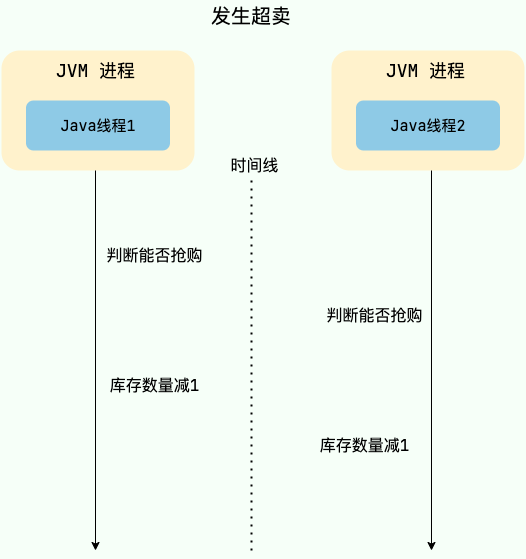

# 多位骑手抢一个外卖订单，如何保证只有一个骑手可以接到单子？

> 类似的问题：
>
>  
>
> + 多位用户抢一个商品，如何保证只有一个用户可以抢到商品？
> + 多位用户抢一个红包，如何保证只有一个抢到？
>


在多线程环境中，如果多个线程同时访问共享资源（例如商品库存、外卖订单），会发生数据竞争，可能会导致出现脏数据或者系统问题，威胁到程序的正常运行。


举个例子，假设现在有 100 个用户参与某个限时秒杀活动，每位用户限购 1 件商品，且商品的数量只有 3 个。如果不对共享资源进行互斥访问，就可能出现以下情况：


+ 线程 1、2、3 等多个线程同时进入抢购方法，每一个线程对应一个用户。
+ 线程 1 查询用户已经抢购的数量，发现当前用户尚未抢购且商品库存还有 1 个，因此认为可以继续执行抢购流程。
+ 线程 2 也执行查询用户已经抢购的数量，发现当前用户尚未抢购且商品库存还有 1 个，因此认为可以继续执行抢购流程。
+ 线程 1 继续执行，将库存数量减少 1 个，然后返回成功。
+ 线程 2 继续执行，将库存数量减少 1 个，然后返回成功。
+ 此时就发生了超卖问题，导致商品被多卖了一份。





为了保证共享资源被安全地访问，我们需要使用互斥操作对共享资源进行保护，即同一时刻只允许一个线程访问共享资源，其他线程需要等待当前线程释放后才能访问。这样可以避免数据竞争和脏数据问题，保证程序的正确性和稳定性。


**如何才能实现共享资源的互斥访问呢？** 锁是一个比较通用的解决方案，更准确点来说是悲观锁。


这里简单总结 3 种常见的锁的实现方案：

| 实现方案 | 举例 | 优点 | 缺点 |
| --- | --- | --- | --- |
| JVM本地锁 | synchronized、 ReentrantLock | 实现简单 | 性能较差，会阻塞所有的抢单请求 |
| MySQL的行锁 | 可以通过使用“SELECT ... FOR UPDATE”和“SELECT ... LOCK IN SHARE MODE”语句来显式地使用行锁 | 可以保证事务的隔离性，能够避免并发情况下的数据冲突问题。 | 性能较差，存在死锁问题，可能会影响数据库的正常使用 |
| 分布式锁 | 通常基于 Redis 或者 ZooKeeper实现分布式锁 | 分布式场景使用，比较灵活，性能较高 | 需要保证第三方中间件的可靠性 |


不建议如下代码所示这样使用 JVM 本地锁，锁粒度太大了。


```java
// 抢单方法加锁
public synchronized void grabOrder() {
  //..
 }
```


我们要的效果是多位骑手抢同一个外卖订单的时候只有一个成功，也就是说针对抢同一个外卖订单这一操作，只能有一个骑手可以获取到对应的锁。然而，这种使用 JVM 本地锁的方式会让限制所有的外卖抢单操作，阻塞所有的抢单请求，效率太低了。


你可以通过基于订单对应的唯一 key 来加锁，这样锁粒度小一些。


```java
String key = "订单对应的唯一 key"；
// intern() 方法会返回字符串对象在常量池中对应的唯一实例
synchronized (key.intern()) {
...
}
```


不过，JVM本地锁在分布式环境下不适用。一般情况下，我们还是用分布式锁更多一些。


利用分布式锁的话，我们可以通过外卖订单对应的唯一 key 来加锁和释放锁。


这里以分布式锁为例，简单说说具体的流程如下：


1. 当骑手抢单时需要先获取到该订单对应的锁；
2. 如果获取锁失败，就说明已经有其他骑手已经接单了，直接提示抢单失败。


面试官提问这个问题之后，可能会顺便挖一些JVM本地锁和分布式锁相关的为。


+ JVM 本地锁相关的内容可以看我写的[Java并发常见面试题总结（中）](https://javaguide.cn/java/concurrent/java-concurrent-questions-02.html)这篇文章。
+ 分布式锁相关的内容可以看我写的[分布式锁常见问题总结](https://javaguide.cn/distributed-system/distributed-lock.html)这篇文章。


另外，除了锁这种方案之外，还有一些其他的方案比如 **唯一索引** ，通过唯一索引保证一个订单只和一个外卖员建立联系。


> 更新: 2023-06-15 15:33:14  
> 原文: <https://www.yuque.com/snailclimb/tangw3/dmi5t01gacg3wa5u>