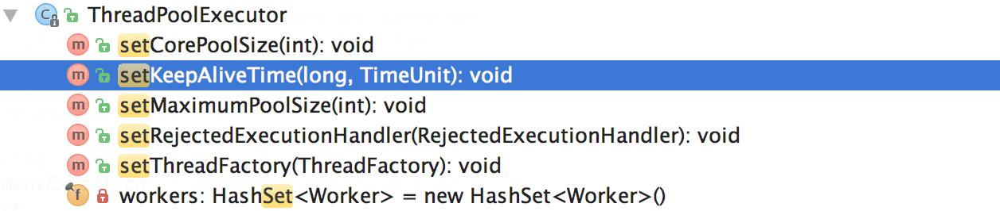
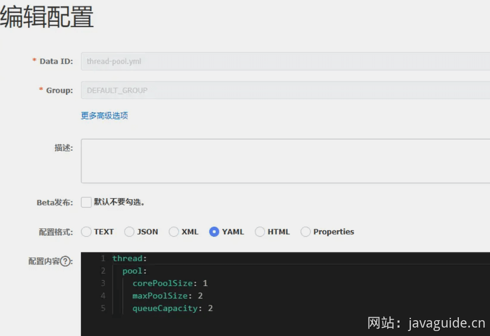
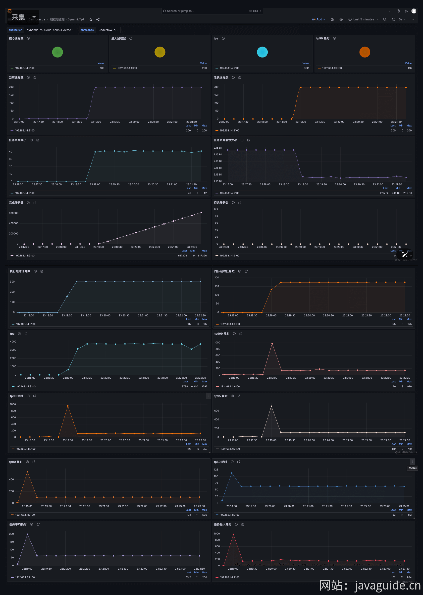

# ⭐如何设计一个动态线程池？

这篇文章我们来简单聊聊动态线程池，探讨一下如何实现一个简易版动态线程池。

看完这篇文章，你完全可以学以致用，自己动手实践，打造一个属于你的动态线程池。这不光可以让你提升编码能力，这个项目还可以作为自己的项目经验。

### 什么是动态线程池？为什么需要动态线程池？

动态线程池是一种能够在应用程序运行过程中，无需重启服务即可实时调整其核心配置参数（如核心线程数、最大线程数等）的线程池机制。通常情况下，动态线程池不仅支持参数的动态变更，还内置了监控和告警功能，例如在发生线程池任务堆积时通知相应的开发人员。

传统线程池存在的痛点：

1. **参数不可动态修改**：传统线程池的参数（如核心线程数、最大线程数和任务队列大小）在创建时被固定。随着业务负载的变化，这种固定配置难以适应，需要调整时必须重启服务，过程繁琐且耗时。
2. **监控不足**：缺乏有效的运行时监控和告警机制，难以及时发现并响应问题，例如无法明确得知是否任务积压过多、活跃线程数是否快达到最大线程数、是否开始执行拒绝策略。
3. **问题难定位**：当线程池运行出现问题例如发生线程池拒绝、线程死锁时，无法及时捕捉线程堆栈信息，从而难以快速定位问题原因。

动态线程池是如何解决这些痛点的？

1. **实时调整参数**：动态线程池能够根据业务负载的变化实时调整线程池参数（如核心线程数和最大线程数），从而提高资源利用率和系统吞吐量。
2. **内置监控和告警功能**：动态线程池通常集成了监控和告警功能，支持实时检测线程池的运行状态以及阻塞队列容量、线程池活跃度、拒绝策略执行等指标的告警。这使得开发人员能够充分了解线程池的运行情况，并及时预防和应对线程池运行过程中出现的异常情况。
3. **线程池运行堆栈**：动态线程池通常支持实时和历史线程栈获取，可以大大增强问题定位和性能调优的能力。

### 如何动态修改线程池的参数？

美团技术团队在[《Java 线程池实现原理及其在美团业务中的实践》](https://tech.meituan.com/2020/04/02/java-pooling-pratice-in-meituan.html)这篇文章中介绍到对线程池参数实现可自定义配置的思路和方法。

美团技术团队的思路是主要对线程池的核心参数实现自定义可配置。这三个核心参数是：

* `corePoolSize`\*\* :\*\* 核心线程数线程数定义了最小可以同时运行的线程数量。
* `maximumPoolSize`\*\* :\*\* 当队列中存放的任务达到队列容量的时候，当前可以同时运行的线程数量变为最大线程数。
* `workQueue`**:** 当新任务来的时候会先判断当前运行的线程数量是否达到核心线程数，如果达到的话，新任务就会被存放在队列中。

**为什么是这三个参数？**

我在[Java 线程池详解](https://javaguide.cn/java/concurrent/java-thread-pool-summary.html) 这篇文章中就说过这三个参数是 `ThreadPoolExecutor` 最重要的参数，它们基本决定了线程池对于任务的处理策略。

**如何支持参数动态配置？** 且看 `ThreadPoolExecutor` 提供的下面这些方法。



格外需要注意的是`corePoolSize`， 程序运行期间的时候，我们调用 `setCorePoolSize()`这个方法的话，线程池会首先判断当前工作线程数是否大于`corePoolSize`，如果大于的话就会回收工作线程。

另外，你也看到了上面并没有动态指定队列长度的方法，美团的方式是自定义了一个叫做 `ResizableCapacityLinkedBlockIngQueue` 的队列（主要就是把`LinkedBlockingQueue`的 capacity 字段的 final 关键字修饰给去掉了，让它变为可变的）。

**知道了如何修改之后，那线程池参数应该如何配置呢？**

我们可以借助配置中心，例如 Nacos、Apollo、Zookeeper。你可以将线程池参数配置在配置中心中，然后在应用启动时从配置中心获取这些参数。并且，你需要监听线程池参数配置，当参数有变更时实现线程池的参数的实时修改。



**不借助中间件可以吗？**

当然是可以的！如果不想多引入一个中间件的话，也是可以不依赖配置中心的。我们自己去监听线程池配置文件是否被修改即可，可以利用 Hutool 的 `WatchMonitor` （基于 `WatchService`，解决了修改文件会触发两次事件的问题）或者 Apache Commons IO 的 `FileAlterationListenerAdaptor` （基于观察者模式）实现文件修改监听。

### 如何获取线程池的一些指标数据？

要获取线程池的指标数据，可以使用以下方法：

* `getCorePoolSize()`：获取核心线程数。
* `getMaximumPoolSize()`：获取最大线程数。
* `getPoolSize()`：获取线程池中的工作线程数（包括核心线程和非核心线程）。
* `getQueue()`：获取线程池中的阻塞队列，可以从队列中获取任务的数量来了解队列积压情况。
* `getActiveCount()`：获取活跃线程数，也就是正在执行任务的线程。
* `getLargestPoolSize()`：获取线程池曾经到过的最大工作线程数。
* `getTaskCount()`：获取历史已完成以及正在执行的总的任务数量。

除了这些线程池指标相关的方法之外，还可以使用`ThreadPoolExecutor`的钩子方法进行扩展：

* `beforeExecute(Thread t, Runnable r)`：在执行每个任务之前调用，可以在此处记录任务开始执行时间。
* `afterExecute(Runnable r, Throwable t)`：在每个任务执行后调用，不论任务是否成功完成，可以用来记录任务执行结束时间。
* `terminated()`：当线程池进入 TERMINATED 状态时调用，可以在此时进行资源清理、统计汇总等操作。

### 如何监控线程池？

我们上面已经知道了如何获取线程池的一些指标数据，通过这些指标数据我们完全可以自己去写一个线程池监控功能。

下面是一个简单的 Demo。`printThreadPoolStatus()`会每隔一秒打印出线程池的线程数、活跃线程数、完成的任务数、以及队列中的任务数。

```java
/**
 * 打印线程池的状态
 *
 * @param threadPool 线程池对象
 */
public static void printThreadPoolStatus(ThreadPoolExecutor threadPool) {
    ScheduledExecutorService scheduledExecutorService = new ScheduledThreadPoolExecutor(1, createThreadFactory("print-images/thread-pool-status", false));
    scheduledExecutorService.scheduleAtFixedRate(() -> {
        log.info("=========================");
        log.info("ThreadPool Size: [{}]", threadPool.getPoolSize());
        log.info("Active Threads: {}", threadPool.getActiveCount());
        log.info("Number of Tasks : {}", threadPool.getCompletedTaskCount());
        log.info("Number of Tasks in Queue: {}", threadPool.getQueue().size());
        log.info("=========================");
    }, 0, 1, TimeUnit.SECONDS);
}
```

不过，这样实现的话，过于简陋。如果想要实现一个支持可视化和告警的线程池监控，会比较麻烦，需要自己去写可视化界面和告警功能。

Spring Boot 提供了 Actuator 模块来监控应用程序的运行状态，包括线程池的使用情况。

```xml
<dependency>
   <groupId>org.springframework.boot</groupId>

    <artifactId>spring-boot-starter-actuator</artifactId>

</dependency>

```

不过，我们一般不会直接使用 SpringBoot Actuator 内置的实现，而是通过定义自定义一个 `Endpoint` 类，手动暴露线程池相关指标信息，这样可以更加灵活和可控。

```java
// 简化版，只暴露了一些核心信息，为了演示方便
@Component
@Endpoint(id = "threadpool")
public class ThreadPoolEndpoint {

    @Autowired
    private ThreadPoolManager threadPoolManager;

    @ReadOperation
    public Map<String, Object> threadPoolsMetric() {
        Map<String, Object> metricMap = new HashMap<>();
        Map<String, Map<String, Object>> threadPools = new HashMap<>();

        threadPoolManager.getThreadPoolExecutorMap().forEach((name, executor) -> {
            MonitorThreadPool tpe = (MonitorThreadPool) executor;
            Map<String, Object> poolInfo = new HashMap<>();
            poolInfo.put("coreSize", tpe.getCorePoolSize());
            poolInfo.put("maxSize", tpe.getMaximumPoolSize());
            poolInfo.put("activeCount", tpe.getActiveCount());
            poolInfo.put("taskCount", tpe.getTaskCount());

            threadPools.put(name, poolInfo);
        });

        metricMap.put("threadPools", threadPools);
        return metricMap;
    }
```

暴露接口之后，我们就可以在 `/actuator/threadpool` 端点获取线程池的相关信息。

```properties
management.endpoints.web.exposure.include=*
```

线程池信息如下：

```json
{
  "threadPools": {
    "pool1": {
      "coreSize": 10,
      "maxSize": 20,
      "activeCount": 5,
      "taskCount": 100
    },
    "pool2": {
      "coreSize": 5,
      "maxSize": 10,
      "activeCount": 2,
      "taskCount": 50
    }
  }
}
```

**线程池信息有了，可视化监控和告警如何实现呢?**

我们可以利用 Prometheus + Grafana，这是最常见的方案。Prometheus 是一个开源的监控和告警系统，它可以从应用的 Endpoint 拉取指标数据，通过 Grafana 可以可视化展示这些指标数据。Grafana 还提供了告警功能，支持发送邮件、短信等通知。

Dynamic TP （一款开源动态线程池框架）集成  Prometheus + Grafana 实现线程池监控的效果图如下：



除了 Prometheus + Grafana，还可以集成其他监控系统来实现可视化监控和告警，例如 [HertzBeat](https://gitee.com/hertzbeat/hertzbeat)（推荐）、[Cubic](https://gitee.com/dromara/cubic)。

Apache HertzBeat（赫兹跳动）是一个拥有强大自定义监控能力，高性能集群，兼容 Prometheus，无需 Agent 的开源实时监控告警系统，。我之前写过一篇文章介绍和推荐这个项目：[自从用了 HertzBeat ，睡觉真香！](https://mp.weixin.qq.com/s/3llRao8Z7WRIDnxV6RkgpQ)。

### 动态线程池开源实现

现成的动态线程池开源实现：

* [Hippo4j](https://github.com/opengoofy/hippo4j)：异步线程池框架，支持线程池动态变更&监控&告警，无需修改代码轻松引入。支持多种使用模式，轻松引入，致力于提高系统运行保障能力。
* [Dynamic TP](https://github.com/dromara/dynamic-tp)：轻量级动态线程池，内置监控告警功能，集成三方中间件线程池管理，基于主流配置中心（已支持 Nacos、Apollo，Zookeeper、Consul、Etcd，可通过 SPI 自定义实现）。

个人建议实际项目优先考虑使用这些成熟稳定的动态线程池开源实现，可以降低开发成本，提高开发效率。

### 总结

本文深入探讨了动态线程池的实现原理、优势以及如何构建一个简易的动态线程池。

文章首先分析了传统线程池的痛点和动态线程池的优势：

* 传统线程池的痛点：参数不可动态修改、监控不足、问题定位困难。
* 动态线程池的优势：实时调整参数、内置监控和告警功能、支持线程池运行堆栈获取。

随后，文章介绍了如何设计一个动态线程池：

* 动态修改线程池参数：
  * 利用 `ThreadPoolExecutor` 提供的 `setCorePoolSize()` 和 `setMaximumPoolSize()` 等方法。
  * 通过配置中心（如 Nacos、Apollo、Zookeeper）或文件监听机制实现参数的实时更新。
* 获取线程池指标数据：
  * 使用 `ThreadPoolExecutor` 提供的 `getCorePoolSize()`、`getMaximumPoolSize()`、`getPoolSize()` 等方法。
  * 利用 `ThreadPoolExecutor` 的钩子方法 `beforeExecute()`、`afterExecute()` 和 `terminated()` 进行扩展。
* 线程池监控：
  * 自行编写代码定期打印线程池状态信息。
  * 使用 Spring Boot Actuator 或自定义 Endpoint 暴露线程池指标数据。
  * 集成 Prometheus + Grafana、HertzBeat 或 Cubic 等监控系统实现可视化监控和告警。

最后，文章推荐了两个优秀的动态线程池开源项目：Hippo4j 和 Dynamic TP，它们提供了开箱即用的动态线程池解决方案，方便开发者快速集成到自己的项目中。

### 参考

* Dynamic TP 官方文档：<https://dynamictp.cn/guide/introduction/background.html>
* Hippo4j 官方文档：<https://hippo4j.cn/docs/user_docs/intro>
* 基于 Actuator 的可修改配置的线程池监控：<https://juejin.cn/post/6902051279154249735>
* [美团一面：Spring Cloud 如何构建动态线程池？ - 技术自由圈](https://www.cnblogs.com/crazymakercircle/p/17398803.html)


> 更新: 2024-09-07 16:25:48  
> 原文: <https://www.yuque.com/snailclimb/tangw3/neiydtd79u8pgple>