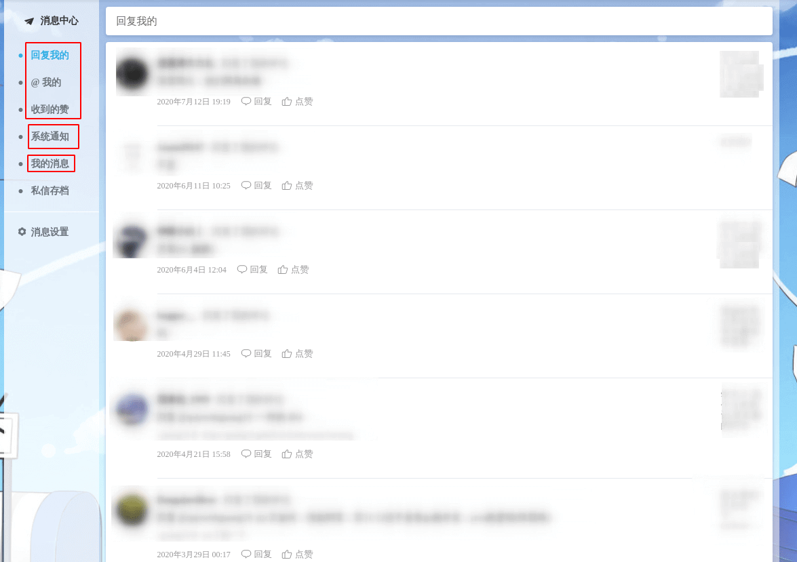
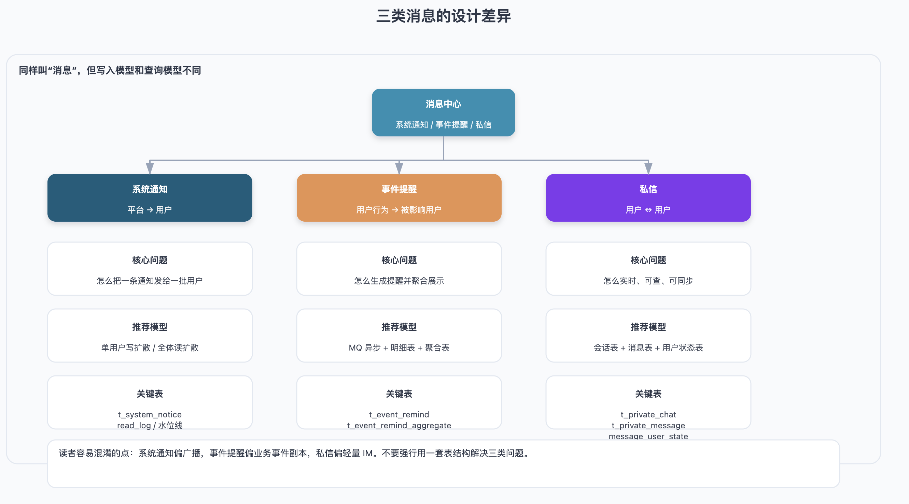
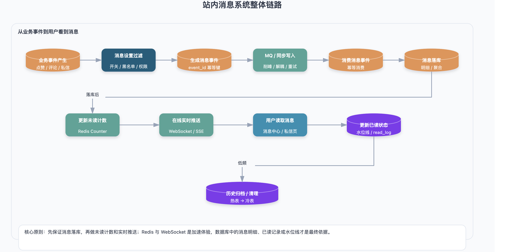
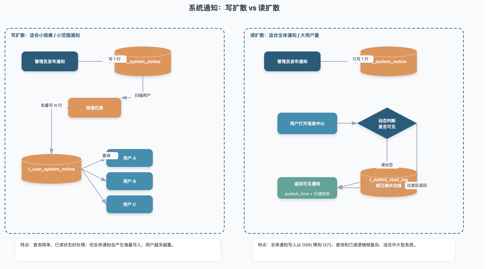
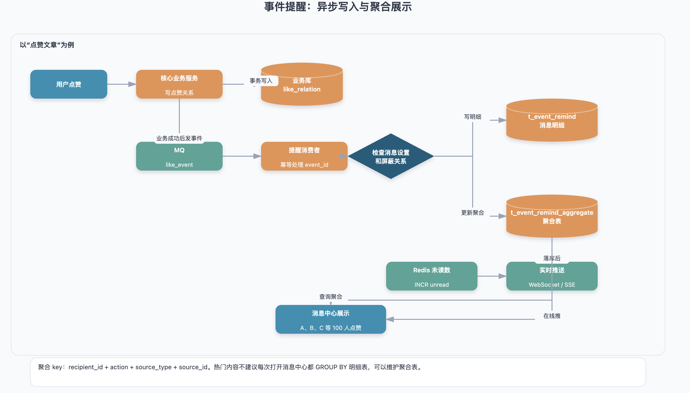
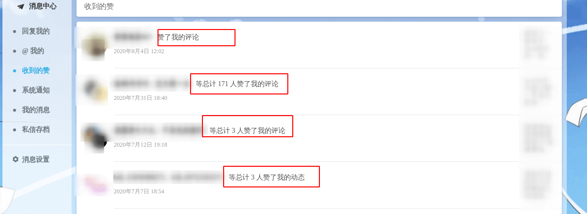
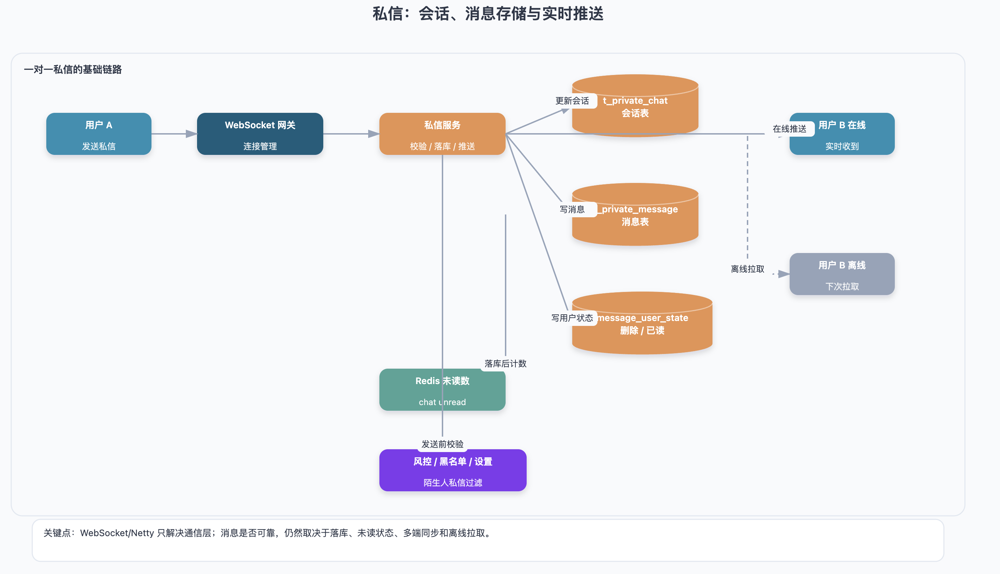
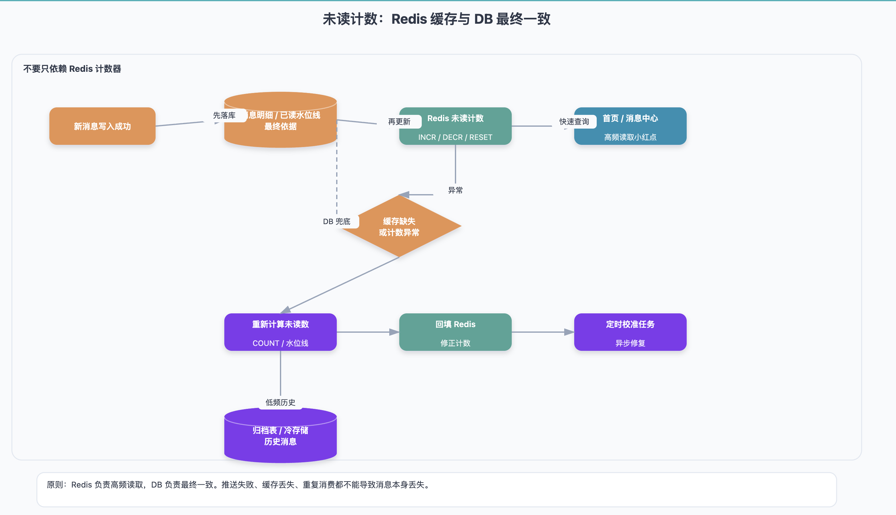

# 如何设计一个站内消息系统？

> 文章不会追求“大厂级复杂架构”，而是从一个普通业务系统出发，聊聊站内消息系统怎么拆、怎么存、怎么查，以及哪些地方容易踩坑。

大家平时用简书、知乎、B 站这类产品时，应该都见过站内消息：

* 有人关注了你；
* 有人回复了你的评论；
* 有人点赞了你的内容；
* 官方给你推送了一条活动通知；
* 有人给你发了一条私信。

这些功能看起来只是几个小红点和消息列表，但背后其实涉及消息分类、写入模型、聚合展示、未读计数、实时推送、已读状态和数据归档等一整套设计。

也正因为如此，站内消息系统虽然不是最核心的交易链路，但它在很多业务里都挺重要：一方面影响用户体验，另一方面也很容易因为数据量增长而变成性能热点。

我以 B 站的消息中心为例，它大致可以分成三类：



1. **系统通知**：官方或平台主动发出的通知，比如活动、公告、审核结果等；
2. **事件提醒**：用户行为触发的提醒，比如回复、@、点赞、关注等；
3. **私信**：用户之间一对一或多对多的聊天消息。

这三个模块看起来都叫“消息”，但设计思路其实不太一样。

系统通知更像平台广播，核心问题是“怎么把一条通知发给一批用户”；事件提醒更像业务事件副本，核心问题是“怎么根据用户行为生成提醒，并做聚合展示”；私信更接近 IM 系统，核心问题是“怎么保证消息实时、可查、可同步”。



下面就按照这三个模块展开。

## 整体链路



在具体讲表结构之前，先看一条站内消息从产生到展示的大致链路：

```latex
业务事件产生
  → 判断用户消息设置
  → 生成消息事件
  → 同步写入或投递到 MQ
  → 消费消息事件
  → 写入消息明细 / 聚合表
  → 更新未读计数
  → 在线用户实时推送
  → 用户读取消息
  → 更新已读状态 / 已读水位线
  → 历史消息归档或清理
```

这个链路不一定每个系统都要完整实现。小系统可以先同步写入数据库，用户打开消息中心时再查询；用户量和消息量上来之后，再逐步引入 MQ、Redis 未读计数、聚合表、WebSocket/SSE 推送和归档策略。

设计消息系统时不要一上来就追求复杂，先搞清楚自己的业务规模和实时性要求更重要。

## 系统通知

系统通知一般由后台管理员或平台系统发出，接收对象可能是单个用户、一批用户，也可能是全体用户。

比如：

* 给某个用户发送审核失败通知；
* 给 VIP 用户发送权益变更通知；
* 给全体用户发送活动公告；
* 给某个地区、某类标签用户发送定向通知。

这类消息的重点不是用户之间互动，而是“平台通知用户”。

### 基础表设计

可以先设计一张系统通知表，用来存通知本体：

```latex
t_system_notice
```

| 字段名 | 类型 | 描述 |
| --- | --- | --- |
| notice\_id | BIGINT | 系统通知 ID |
| title | VARCHAR | 通知标题 |
| content | TEXT | 通知内容 |
| target\_type | VARCHAR | 接收对象类型：single、all、vip、tag 等 |
| target\_condition | VARCHAR / JSON | 接收条件，比如用户 ID、标签、会员等级等 |
| publisher\_id | BIGINT | 发布人 ID |
| status | VARCHAR | 状态：draft、published、cancelled |
| publish\_time | DATETIME | 发布时间 |
| create\_time | DATETIME | 创建时间 |
| update\_time | DATETIME | 更新时间 |

如果是单用户通知，`target_condition` 可以存用户 ID；如果是全体通知，`target_type = all` 即可；如果是定向通知，可以用 JSON 存筛选条件，比如用户等级、地区、标签等。

注意，原来很多设计里会给通知表加一个 `state` 字段，用来表示“是否已经被拉取过”。这个字段不太准确，因为“通知是否发布”和“通知是否投递完成”不是一回事。

更合理的做法是：

* 通知表记录通知本体和发布状态；
* 投递状态如果有必要，可以单独设计投递任务表；
* 用户是否已读，放在用户通知表或已读记录表里。

### 写扩散：适合小规模系统

最容易想到的方案是写扩散。

管理员发布一条通知后，系统根据通知的接收范围，把这条通知写入每个用户的通知表。

例如：

```latex
t_user_system_notice
```

| 字段名 | 类型 | 描述 |
| --- | --- | --- |
| user\_notice\_id | BIGINT | 主键 ID |
| notice\_id | BIGINT | 系统通知 ID |
| recipient\_id | BIGINT | 接收用户 ID |
| read\_state | TINYINT | 是否已读 |
| pull\_time | DATETIME | 投递时间 |
| read\_time | DATETIME | 阅读时间 |

如果通知只发给一个用户，就插入一条记录；如果通知发给 10 万个用户，就插入 10 万条记录。

这个方案的优点是实现简单。用户查询自己的通知时，只需要查 `t_user_system_notice` 即可，已读状态也很好处理。

但缺点也很明显：如果用户量达到百万、千万级，全体通知每发一次就要写入海量数据。全体通知频率一高，数据库写入压力会非常大，很多记录也可能永远不会被不活跃用户读取，造成明显浪费。

所以写扩散适合：

* 用户量不大；
* 全体通知频率很低；
* 系统希望实现简单；
* 对存储成本不敏感。

如果是中大型系统，尤其是全体通知比较多，就应该考虑读扩散。

### 读扩散：更适合全体通知

读扩散的核心思路是：**全体通知不再给每个用户生成一条记录，只保存通知本体，等用户打开消息中心时再动态拉取。**

比如全体通知只写入 `t_system_notice` 一条记录。用户查询时，根据发布时间、用户注册时间、已读状态来判断哪些通知对他可见。

一个简单查询可以这样理解：

```sql
SELECT *
FROM t_system_notice
WHERE target_type = 'all'
  AND status = 'published'
  AND publish_time >= ?
ORDER BY publish_time DESC
LIMIT 20;
```

这里的时间条件可以是用户注册时间。也就是说，用户只能看到自己注册之后发布的全体通知。

全体通知的已读状态可以用两种方式处理。

第一种是已读记录表：

```latex
t_notice_read_log
```

| 字段名 | 类型 | 描述 |
| --- | --- | --- |
| id | BIGINT | 主键 ID |
| user\_id | BIGINT | 用户 ID |
| notice\_id | BIGINT | 通知 ID |
| read\_time | DATETIME | 阅读时间 |

用户读了某一条通知，就写一条已读记录。查询未读通知时，过滤掉已经存在已读记录的通知即可。

第二种是已读水位线：

```latex
user.last_read_notice_time
```

用户点击“全部已读”时，只需要更新这个时间。之后 `publish_time > last_read_notice_time` 的通知都可以视为未读。

水位线的优点是写入成本很低，适合“全部已读”场景；缺点是不适合表达“只读了其中某一条”。如果需要支持单条已读，还是要配合已读记录表。

实际项目中，常见做法是两者结合：

* 用 `last_read_notice_time` 处理“全部已读”；
* 用 `t_notice_read_log` 处理单条已读；
* 全体通知只写通知本体，不给每个用户生成一条记录。

这样全体通知的写入量就从 O(N) 降到了 O(1)。

### 写扩散和读扩散怎么选？



可以简单总结成下面这样：

| 模式 | 做法 | 优点 | 缺点 | 适合场景 |
| --- | --- | --- | --- | --- |
| 写扩散 | 发布时给每个用户生成一条通知记录 | 查询简单，已读状态好处理 | 写入量大，存储浪费明显 | 用户量小、通知频率低 |
| 读扩散 | 只写通知本体，用户读取时动态拉取 | 写入量低，适合全体通知 | 查询和已读逻辑稍复杂 | 用户量大、全体通知多 |
| 混合模式 | 单用户/小范围写扩散，全体通知读扩散 | 兼顾性能和实现复杂度 | 逻辑稍复杂 | 大多数中大型业务系统 |

我个人更推荐混合模式：

* 单用户通知、小范围通知：写扩散；
* 全体通知、大范围通知：读扩散；
* 重要通知：可以额外做强提醒或弹窗；
* 历史通知：定期归档或只保留最近几个月。

### 分表能解决全体通知问题吗？

有人可能会想到分表，比如按 `user_id` 分库分表。

分表确实可以缓解单表数据量过大的问题，但它不能从根本上减少全体通知的写入量。

比如你有 1000 万用户，一条全体通知如果采用写扩散，无论你分成 16 张表还是 64 张表，本质上还是要写入 1000 万条用户通知记录。

所以分表解决的是“单表太大、查询太慢”的问题，不解决“全量广播写入太多”的问题。

更合理的说法是：

> 按 `user_id` 做水平分表，例如根据 `hash(user_id) % N` 路由到不同的消息分表。分表可以缓解单表数据量和查询压力，但不能减少全体通知的总写入量。全体通知更适合采用读扩散。

## 事件提醒

事件提醒是由用户行为触发的消息，比如：

* xxx 在评论中 @ 了你；
* xxx 点赞了你的文章；
* xxx 点赞了你的评论；
* xxx 回复了你的文章；
* xxx 回复了你的评论；
* xxx 关注了你。

这类消息和系统通知不一样，它们通常和具体业务对象有关。

比如“点赞了你的文章”，这里至少包含几个信息：

* 谁点的赞；
* 点赞了谁；
* 点赞的对象是什么；
* 对象 ID 是多少；
* 什么时候发生的；
* 当前是否还有效。

因此，事件提醒不能只看成一条简单文本，而应该看成业务事件的副本。

### 基础表设计

可以设计一张事件提醒明细表：

```latex
t_event_remind
```

| 字段名 | 类型 | 描述 |
| --- | --- | --- |
| event\_remind\_id | BIGINT | 消息 ID |
| event\_id | VARCHAR | 业务事件 ID，用于幂等 |
| action | VARCHAR | 动作类型：like、reply、at、follow 等 |
| source\_type | VARCHAR | 事件源类型：post、comment、user 等 |
| source\_id | BIGINT | 事件源 ID |
| source\_content | VARCHAR | 事件源内容快照 |
| sender\_id | BIGINT | 触发事件的用户 ID |
| recipient\_id | BIGINT | 接收提醒的用户 ID |
| status | VARCHAR | 状态：unread、read、cancelled |
| remind\_time | DATETIME | 提醒时间 |
| create\_time | DATETIME | 创建时间 |

这里有几个字段需要特别说明。

`action` 表示动作，比如点赞、回复、@、关注。

`source_type + source_id` 表示事件发生在哪个对象上，比如文章、评论、用户主页等。

`source_content` 是源内容快照，比如评论内容、文章标题、回复摘要。保留快照的好处是查询提醒列表时不用回查源表，性能更好；缺点是源内容被编辑或删除后，提醒里的内容不会自动变化。

这个取舍要看业务。如果只是展示摘要，保留快照没问题；如果要求内容严格实时一致，就需要查询时回查源表。但大多数消息中心展示的都是摘要，保留快照更常见。

另外，不建议只存一个固定 `url`。更稳妥的做法是存 `source_type + source_id`，由前端或网关根据业务类型生成跳转链接。这样后续页面路由变了，也不用批量修改历史消息。

### 幂等问题

事件提醒很容易遇到重复写入。

比如：

* 用户重复点击点赞按钮；
* MQ 重复投递；
* 消费端重试；
* 接口超时后客户端重试；
* 同一个业务事件被多个服务重复处理。

所以事件提醒一定要考虑幂等。

对于点赞、关注这类“同一用户对同一对象只应该产生一次”的事件，可以加唯一约束：

```sql
UNIQUE KEY uk_event_dedup (
  sender_id,
  recipient_id,
  action,
  source_type,
  source_id
);
```

但这个唯一约束不适合所有场景。

比如评论和回复，一个用户可以多次评论同一篇文章。如果仍然用 `sender_id + action + source_type + source_id` 去重，就会误删合法事件。

这类场景更适合引入 `event_id`，比如：

* 评论提醒：`event_id = comment_id`
* 回复提醒：`event_id = reply_id`
* @提醒：`event_id = mention_id`
* 关注提醒：`event_id = follow_id`

这样消费端可以根据 `event_id` 保证幂等。

### 消息聚合



事件提醒里最典型的优化就是聚合。

比如你发了一篇文章，有 100 个人点赞。如果消息中心展示 100 条“xxx 点赞了你的文章”，体验会很差。

更好的展示方式是：

> A、B、C 等 100 人点赞了你的文章《xxx》。



聚合的关键是找到聚合维度。

对于点赞文章，聚合维度通常是：

```latex
recipient_id + action + source_type + source_id
```

也就是：

> 同一个接收人、同一种动作、同一个业务对象，聚合成一条提醒。

如果只是临时查询，可以直接在 SQL 层做聚合：

```sql
SELECT source_type,
       source_id,
       COUNT(*) AS remind_count,
       MAX(remind_time) AS latest_time
FROM t_event_remind
WHERE recipient_id = ?
  AND action = 'like'
  AND status = 'unread'
GROUP BY source_type, source_id
ORDER BY latest_time DESC
LIMIT 20;
```

需要注意，不建议写成：

```sql
SELECT *
FROM t_event_remind
GROUP BY source_type, source_id;
```

这种写法在语义上是不严谨的。`SELECT *` 中很多字段既不是分组字段，也不是聚合字段，结果不稳定，容易误导读者。

如果事件提醒量不大，SQL 聚合可以接受。但如果是内容社区，点赞、评论、关注非常频繁，每次打开消息中心都对明细表 `GROUP BY`，压力会比较大。

更稳的方案是单独维护一张聚合表：

```latex
t_event_remind_aggregate
```

| 字段名 | 类型 | 描述 |
| --- | --- | --- |
| aggregate\_id | BIGINT | 聚合 ID |
| recipient\_id | BIGINT | 接收用户 ID |
| action | VARCHAR | 动作类型 |
| source\_type | VARCHAR | 事件源类型 |
| source\_id | BIGINT | 事件源 ID |
| remind\_count | INT | 聚合数量 |
| latest\_sender\_id | BIGINT | 最近一次触发用户 |
| latest\_remind\_time | DATETIME | 最近提醒时间 |
| read\_state | TINYINT | 是否已读 |
| update\_time | DATETIME | 更新时间 |

写入事件提醒时，同时更新聚合表：

* 如果聚合记录不存在，就插入一条；
* 如果聚合记录已存在，就更新 `remind_count`、`latest_sender_id`、`latest_remind_time`；
* 消息列表查询聚合表；
* 用户点击详情时，再查询事件提醒明细表。

这样消息中心列表页的查询压力会小很多。

### 取消操作怎么处理？

事件提醒还有一个高频场景：用户点赞后又取消点赞。

如果点赞时已经生成了一条提醒，取消点赞后这条提醒就变成了脏数据。收件人看到“xxx 点赞了你的文章”，点进去发现对方已经取消了点赞，体验会比较奇怪。

常见处理方式有三种。

第一种是软删除。取消点赞时，将对应提醒标记为 `cancelled`，查询时过滤掉。

第二种是物理删除。取消点赞时直接删除对应提醒记录。实现简单，但要求能准确定位那条提醒，比如通过 `sender_id + action + source_type + source_id` 查找。

第三种是延迟写入。点赞后不立即生成提醒，而是延迟 5 到 10 分钟再写入。如果用户在延迟期内取消点赞，就不生成提醒。这种方式可以过滤掉很多“手滑点赞又取消”的情况，但牺牲了一部分实时性。

一般来说，软删除更稳一些。它保留了事件轨迹，也方便排查问题。

另外，提醒消息只是业务事件的副本，不能完全替代业务状态。用户点击提醒跳转时，仍然要校验：

* 源内容是否还存在；
* 点赞、关注、回复关系是否仍然有效；
* 当前用户是否还有权限查看；
* 内容是否被删除、审核下架或作者拉黑。

否则消息列表看起来没问题，跳转后依然可能出错。

### 事件提醒是否一定要用 MQ？

不一定。

如果系统规模很小，点赞、评论量都不大，业务操作完成后同步写入提醒表完全可以接受。

当提醒写入开始影响主链路性能，或者你需要削峰、重试、解耦时，再引入 MQ 更合适。

常见链路是：

```latex
用户点赞 / 评论 / 回复
  → 核心业务写入成功
  → 发送事件消息到 MQ
  → 消费端生成提醒
  → 更新聚合表和未读计数
  → 推送给在线用户
```

MQ 消费端需要保证幂等，不能因为重复消费生成重复提醒。

另外，通知写入失败通常不应该影响核心业务。比如点赞已经成功了，但提醒生成失败，不能把点赞操作回滚。更合理的方式是记录失败日志，通过重试或补偿任务修复。

## 私信

私信和系统通知、事件提醒不太一样。它更接近一个轻量 IM 系统。

它至少要解决几个问题：

* 会话列表怎么展示；
* 消息明细怎么存；
* 未读数怎么统计；
* 用户在线时怎么实时推送；
* 用户离线后怎么拉取历史消息；
* 删除和撤回怎么处理；
* 多端登录时怎么同步。

如果只是做一个普通站内私信，不一定要上完整 IM 架构，但基础模型要设计清楚。

### 会话表

一对一私信可以先设计一张会话表：

```latex
t_private_chat
```

| 字段名 | 类型 | 描述 |
| --- | --- | --- |
| private\_chat\_id | BIGINT | 会话 ID |
| small\_user\_id | BIGINT | 较小的用户 ID |
| large\_user\_id | BIGINT | 较大的用户 ID |
| last\_message | VARCHAR | 最后一条消息摘要 |
| last\_message\_time | DATETIME | 最后一条消息时间 |
| create\_time | DATETIME | 创建时间 |
| update\_time | DATETIME | 更新时间 |

这里不建议直接用 `user1_id` 和 `user2_id`，因为两个字段没有固定顺序时，容易出现重复会话：

```latex
user1_id = 1, user2_id = 2
user1_id = 2, user2_id = 1
```

更稳妥的做法是把两个用户 ID 按大小排序后存储：

```latex
small_user_id = min(user_a, user_b)
large_user_id = max(user_a, user_b)
```

然后加唯一索引：

```sql
UNIQUE KEY uk_chat_pair(small_user_id, large_user_id);
```

这样可以保证任意两个用户之间只有一个私信会话。

会话表里的 `last_message` 和 `last_message_time` 是典型冗余字段，主要用于会话列表排序和展示。每次发送新消息时，都要更新这两个字段。

### 私信消息表

私信明细可以设计成这样：

```latex
t_private_message
```

| 字段名 | 类型 | 描述 |
| --- | --- | --- |
| private\_message\_id | BIGINT | 私信消息 ID |
| private\_chat\_id | BIGINT | 所属会话 ID |
| sender\_id | BIGINT | 发送者 ID |
| recipient\_id | BIGINT | 接收者 ID |
| message\_type | VARCHAR | 消息类型：text、image、file、card、system |
| content | TEXT | 消息内容 |
| extra | JSON | 扩展字段 |
| status | VARCHAR | 状态：normal、recalled |
| send\_time | DATETIME | 发送时间 |

这里建议加 `message_type`，不要默认所有私信都是纯文本。即使当前只支持文本，后续也可能支持图片、文件、表情、卡片消息或系统提示。

`content` 可以存文本，也可以存结构化内容。更复杂的消息可以把扩展信息放到 `extra` 字段里。

### 删除、已读和多端同步

很多设计会在消息表里加：

```latex
sender_remove
recipient_remove
```

表示发送方或接收方是否删除了这条消息。

如果只做一对一私信，这种设计可以跑起来。但它扩展性一般，后续如果支持群聊、多端已读、每个用户独立删除，就会不够用。

更通用的做法是拆一张用户消息状态表：

```latex
t_private_message_user_state
```

| 字段名 | 类型 | 描述 |
| --- | --- | --- |
| id | BIGINT | 主键 ID |
| message\_id | BIGINT | 消息 ID |
| user\_id | BIGINT | 用户 ID |
| is\_deleted | TINYINT | 当前用户是否删除 |
| read\_time | DATETIME | 当前用户阅读时间 |
| create\_time | DATETIME | 创建时间 |
| update\_time | DATETIME | 更新时间 |

这样可以支持：

* 每个用户独立删除；
* 每个用户独立已读；
* 多端同步已读状态；
* 后续扩展群聊。

如果文章只想讲入门方案，可以保留 `sender_remove / recipient_remove`，但最好说明它适用于一对一简单私信，不适合复杂 IM 场景。

### 实时推送



私信通常对实时性要求更高。

服务端可以通过 WebSocket 维护长连接，Java 技术栈里常见实现是 Netty。但要注意，Netty 只是解决连接和通信层问题，不等于私信系统本身。

一个完整私信链路通常是：

```latex
用户 A 发送消息
  → 服务端校验权限和风控
  → 消息落库
  → 更新会话 last_message
  → 更新用户 B 未读数
  → 如果用户 B 在线，通过 WebSocket 推送
  → 如果用户 B 离线，等下次上线后从数据库拉取
```

所以即使 WebSocket 推送失败，也不代表消息丢失。只要消息已经落库，用户下次进入私信页面时仍然能查到。

## 消息设置

消息设置一般由用户自己控制，常见配置包括：

* 是否接收点赞提醒；
* 是否接收回复提醒；
* 是否接收 @ 提醒；
* 是否接收关注提醒；
* 是否接收陌生人私信；
* 是否接收系统活动通知。

可以设计一张用户消息设置表：

```latex
t_user_message_setting
```

| 字段名 | 类型 | 描述 |
| --- | --- | --- |
| user\_id | BIGINT | 用户 ID |
| like\_message | TINYINT | 是否接收点赞提醒 |
| reply\_message | TINYINT | 是否接收回复提醒 |
| at\_message | TINYINT | 是否接收 @ 提醒 |
| follow\_message | TINYINT | 是否接收关注提醒 |
| stranger\_message | TINYINT | 是否接收陌生人私信 |
| system\_notice | TINYINT | 是否接收普通系统通知 |
| update\_time | DATETIME | 更新时间 |

消息设置需要参与写入链路。

例如用户关闭点赞提醒后，点赞事件发生时，就可以不再生成点赞提醒，避免写入无效数据。

但并不是所有消息都应该允许用户关闭。比如账号安全、交易状态、审核结果、违规通知这类重要系统通知，通常不应该被普通消息设置屏蔽。

私信还要额外结合：

* 是否互相关注；
* 是否是陌生人；
* 是否被拉黑；
* 是否命中风控规则；
* 是否允许陌生人私信。

所以消息设置不是简单查一个 boolean 字段就结束，它通常是消息投递前的一层过滤规则。

## 未读消息计数



消息中心最显眼的功能就是小红点和未读数。

未读数看起来简单，但它是典型的高频读取场景。用户打开首页、刷新页面、进入消息中心、切换 Tab，都可能查询未读数。

最简单的做法是每次都查数据库：

```sql
SELECT COUNT(*)
FROM t_event_remind
WHERE recipient_id = ?
  AND status = 'unread';
```

数据量小时没问题。数据量大了以后，这种查询会越来越重。

更常见的做法是使用 Redis 维护未读计数：

```latex
unread:system:{userId}
unread:remind:{userId}
unread:chat:{chatId}:{userId}
```

新消息写入成功后，Redis 计数 `INCR`；用户阅读后，计数 `DECR` 或重置。

不过这里要特别注意：Redis 未读数只能作为缓存，不能作为唯一数据源。

因为它很容易出现不一致：

* 消息落库成功，但 Redis 更新失败；
* Redis 更新成功，但数据库事务回滚；
* MQ 重复消费导致计数重复增加；
* 用户重复点击已读导致计数多减；
* Redis 数据过期或丢失；
* 多端同时阅读导致并发更新。

更稳妥的做法是：

1. 数据库中的消息明细、已读记录或已读水位线作为最终依据；
2. Redis 保存高频读取的未读计数；
3. 缓存缺失或发现异常时，从数据库重新计算并回填；
4. 可以通过定时任务做未读数校准。

对于“全部已读”，不建议逐条更新每一条消息的状态。更好的方式是维护一个已读水位线。

例如事件提醒可以在用户表或单独状态表中维护：

```latex
last_read_remind_time
```

用户点击“全部已读”时，只更新这个时间戳即可。查询未读提醒时，`remind_time > last_read_remind_time` 的提醒视为未读。

这样“全部已读”的写入量可以从 O(N) 降到 O(1)。

当然，如果要支持单条已读，还是需要消息明细状态或已读记录表。水位线适合批量已读，不适合表达所有细粒度状态。

## 消息推送机制

站内消息不一定都要实时推送。

不同类型的消息，对实时性要求不一样：

* 私信：实时性要求最高；
* @、回复：实时性较高；
* 点赞、关注：可以稍微延迟；
* 系统公告：实时性通常没那么强。

常见推送方案有几种：

| 方案 | 原理 | 优点 | 缺点 | 适用场景 |
| --- | --- | --- | --- | --- |
| 短轮询 | 前端定时请求后端 | 实现简单 | 延迟高，请求多 | 实时性要求低 |
| 长轮询 | 后端有新消息才返回，否则挂起一段时间 | 延迟低于短轮询 | 连接管理稍复杂 | 中等实时性 |
| SSE | 服务端向客户端单向推送 | 比 WebSocket 轻量 | 只能服务端推客户端 | 通知、小红点 |
| WebSocket | 双向通信，服务端可主动推送 | 实时性最好 | 需要维护长连接 | 私信、在线聊天 |

私信通常适合 WebSocket。系统通知和事件提醒可以用 SSE、长轮询，甚至只在用户刷新或打开消息中心时拉取。

推送失败也不应该视为消息丢失。只要消息已经落库，实时推送只是“加速用户看到消息”的方式，用户下次主动拉取时仍然能查到。

## 索引建议

消息系统的查询大多围绕 `user_id`、状态、时间、类型展开。索引设计要围绕高频查询场景来做。

系统通知：

```sql
-- 查询用户已读记录
CREATE INDEX idx_notice_read_user
ON t_notice_read_log(user_id, notice_id);

-- 查询已发布系统通知
CREATE INDEX idx_system_notice_publish
ON t_system_notice(target_type, status, publish_time);
```

事件提醒：

```sql
-- 查询某个用户的某类提醒
CREATE INDEX idx_event_remind_user
ON t_event_remind(recipient_id, action, status, remind_time);

-- 查询某个聚合维度下的明细
CREATE INDEX idx_event_remind_source
ON t_event_remind(recipient_id, action, source_type, source_id, remind_time);

-- 幂等索引，具体字段要结合业务类型调整
CREATE UNIQUE INDEX uk_event_id
ON t_event_remind(event_id);
```

事件提醒聚合表：

```sql
-- 聚合唯一键
CREATE UNIQUE INDEX uk_event_aggregate
ON t_event_remind_aggregate(recipient_id, action, source_type, source_id);

-- 查询某个用户的聚合提醒列表
CREATE INDEX idx_event_aggregate_user
ON t_event_remind_aggregate(recipient_id, read_state, latest_remind_time);
```

私信：

```sql
-- 保证一对一会话唯一
CREATE UNIQUE INDEX uk_chat_pair
ON t_private_chat(small_user_id, large_user_id);

-- 查询某个会话的消息列表
CREATE INDEX idx_private_msg_chat
ON t_private_message(private_chat_id, send_time);

-- 查询用户消息状态
CREATE INDEX idx_private_msg_user_state
ON t_private_message_user_state(user_id, message_id);
```

索引不是越多越好。消息表写入量通常不小，索引太多会拖慢写入。实际项目里要结合查询场景、数据量和慢 SQL 结果继续调整。

## 数据生命周期

消息数据是典型的持续增长型数据。

每天都有新消息写入，但大部分历史消息访问频率很低。如果一直堆在热表里，表会越来越大，查询和维护都会变慢。

可以按消息类型制定不同的保留策略：

* 已读事件提醒：保留 30 到 90 天后归档或删除；
* 点赞、关注类提醒：可以只保留最近几个月；
* 系统通知：只展示最近 6 到 12 个月；
* 私信：保留时间通常更长，但可以按时间分表或归档；
* 审计类消息：如果涉及合规要求，需要单独长期保存。

常见做法是：

```latex
热表：保存近期消息，支撑高频查询
冷表：保存历史消息，低频查询
定时任务：按时间迁移或清理
```

比如：

```latex
t_event_remind
t_event_remind_archive
```

热表只保留最近 90 天数据，超过时间的已读提醒迁移到归档表。

私信由于用户可能会翻历史记录，不能简单粗暴删除。可以按会话和时间分页查询，也可以做冷热分层，把很久以前的消息放到冷存储中。

## 可靠性设计

消息系统虽然不是交易系统，但也不能完全不考虑可靠性。

常见问题包括：

* 业务操作成功了，提醒没生成；
* MQ 重复消费，生成了重复提醒；
* 消息落库成功，但未读数更新失败；
* 实时推送失败；
* 用户已读状态更新失败；
* 缓存中的未读数和数据库不一致。

比较稳妥的原则是：

1. **核心业务优先**：点赞、评论、回复这些核心操作不应该因为提醒写入失败而失败。
2. **消息消费要幂等**：通过 `event_id` 或唯一约束避免重复提醒。
3. **先落库，再更新计数和推送**：数据库是最终依据，Redis 和 WebSocket 都只是辅助。
4. **推送失败不等于消息丢失**：用户下次打开消息中心时仍然可以从数据库拉取。
5. **未读数允许短暂不一致，但要能校准**：Redis 计数可以异步修正，不能长期错误。
6. **重要通知要有补偿机制**：比如失败重试、死信队列、补偿任务等。

对于普通社区类消息，允许短时间最终一致；对于账号安全、交易、审核这类重要消息，则需要更严格的投递和补偿机制。

## 一个推荐版设计

如果是一个中等规模的业务系统，我会倾向于这样的设计：

### 系统通知

```latex
t_system_notice
t_notice_read_log
user.last_read_notice_time
```

* 单用户、小范围通知：写扩散；
* 全体通知：读扩散；
* 单条已读：写 `t_notice_read_log`；
* 全部已读：更新 `last_read_notice_time`。

### 事件提醒

```latex
t_event_remind
t_event_remind_aggregate
t_user_message_setting
```

* 明细表保存每条事件；
* 聚合表支撑消息列表展示；
* `event_id` 保证幂等；
* 取消点赞等操作通过 `cancelled` 状态处理；
* 大流量场景用 MQ 异步写入。

### 私信

```latex
t_private_chat
t_private_message
t_private_message_user_state
```

* 会话表保存用户会话和最后一条消息；
* 消息表保存消息内容；
* 用户消息状态表保存每个用户的删除、已读状态；
* WebSocket 负责实时推送；
* 离线消息从数据库拉取。

### 未读数

```latex
Redis unread counter
DB read log / read watermark
```

* Redis 负责高频读取；
* DB 负责最终一致；
* 缓存异常时重新计算；
* 定时任务做校准。

## 总结

站内消息系统看起来只是“发通知”和“小红点”，但真正设计起来并不简单。

系统通知要重点考虑写扩散和读扩散的取舍；事件提醒要考虑业务事件、幂等、聚合、取消操作和权限校验；私信则要考虑会话、消息明细、已读删除、多端同步和实时推送。

如果是小系统，完全没必要一开始就上 MQ、WebSocket、聚合表、冷热分离，可以先用简单表结构跑起来。

但如果用户量和消息量会上来，下面几个点一定要提前想清楚：

1. 全体通知不要轻易给每个用户写一条记录；
2. 事件提醒要有幂等机制，避免重复消息；
3. 热门内容的点赞、评论提醒最好做聚合；
4. 未读数不要只依赖 Redis，数据库要能兜底；
5. 实时推送失败不代表消息丢失，消息落库才是关键；
6. 历史消息要有归档或清理策略，否则表会持续膨胀。

简单来说，站内消息系统的核心不是“设计几张表”，而是根据不同消息类型，选择合适的写入模型、读取模型和一致性策略。


> 更新: 2026-05-16 21:00:17  
> 原文: <https://www.yuque.com/snailclimb/tangw3/hxgr1wqsg7grt8k5>