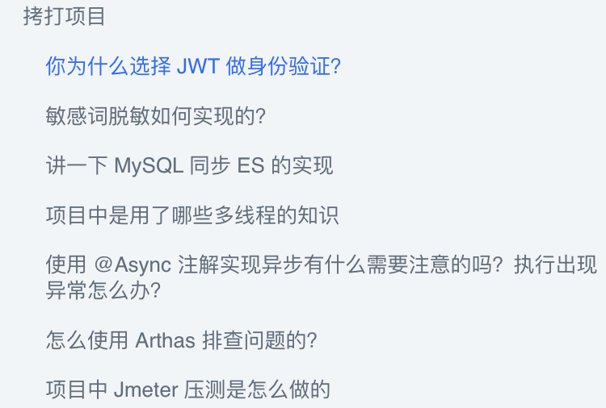
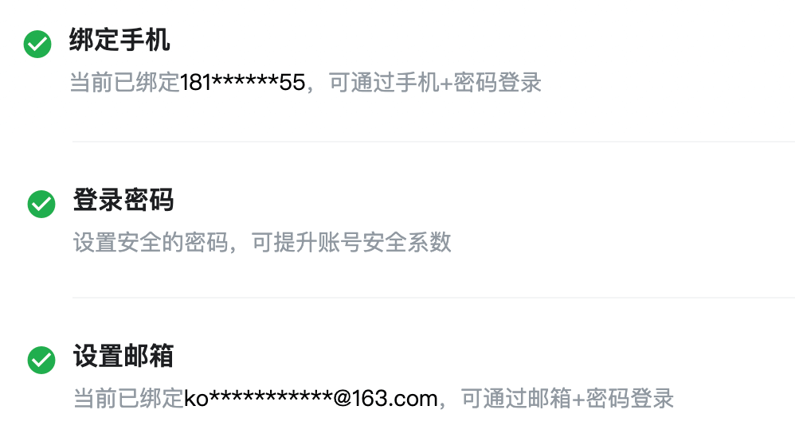
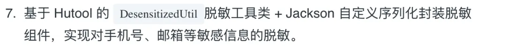
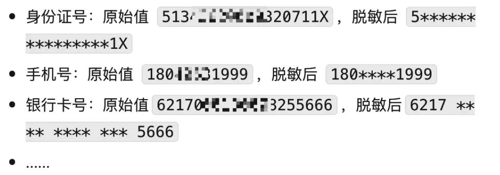
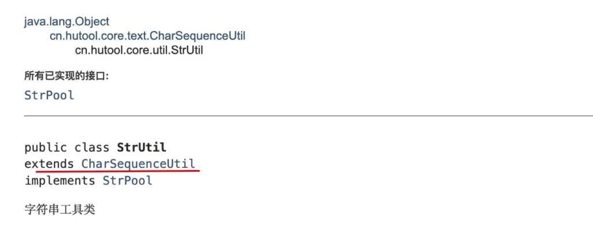
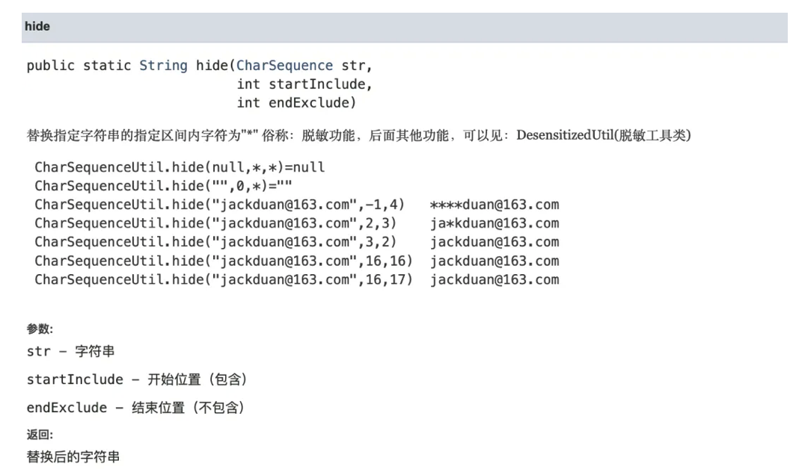

# ⭐你的项目敏感词脱敏是如何实现的？

这道面试题是一位读者参加美团面试被拷打项目时问到的。



我们这里讨论的是后端返回数据给前端这一场景。后端返回数据给前端的时候，一般需要对敏感词脱敏，类似于下面这样：



简单来说，数据脱敏是指对某些敏感信息通过脱敏规则进行数据的变形，实现敏感隐私数据的可靠保护。

脱敏的规则有很多种，例如：

* 替换(常用)：将敏感数据中的特定字符或字符序列替换为其他字符。例如，将信用卡号中的中间几位数字替换为星号（\*）或其他字符。
* 删除：将敏感数据中的部分内容随机删除。例如，将电话号码的随机 3 位数字进行删除。
* 重排：将原始数据中的某些字符或字段的顺序打乱。例如，将身份证号码的随机位交错互换。
* 加噪：在数据中注入一些误差或者噪音，达到对数据脱敏的效果。例如，在敏感数据中添加一些随机生成的字符。
* ......

这里以最常用的替换为例进行介绍，这也是我的项目用到的方法。

这里先以这位读者项目中实际使用的方法为例进行介绍。



### Hutool + Jackson

我是利用 Hutool 提供的 `DesensitizedUtil`脱敏工具类配合 Jackson 通过注解的方式完成数据脱敏的。如果不想引入 Hutool 的话，也可以自己实现一个脱敏工具类，实现逻辑非常简单。或者，直接把 Hutool 的脱敏实现拿来用。

`DesensitizedUtil`脱敏工具类支持用户 ID、中文姓名、身份证号、座机号、手机号、电子邮件、银行卡号等脱敏数据类型，基本覆盖了常见的敏感信息。

`DesensitizedUtil`脱敏工具类的脱敏规则是隐藏掉信息中的一部分关键信息用`*`代替，例如：



除了支持常见的脱敏数据类型之外，Hutool 还提供了自定义隐藏方法`StrUtil#hide`。这个方法实际上是 `CharSequenceUtil`实现的，`StrUtil`继承了`CharSequenceUtil`。





因为我的项目是基于  Spring Boot 开发的，因此可以利用 Spring Boot 自带的 Jackson 自定义序列化实现，在 JSON 进行序列化渲染给前端时，进行脱敏。

下面是简化后的核心步骤：

1、我定义了一个用于脱敏的 `Desensitization` 注解。

```java
@Target(ElementType.FIELD)
@Retention(RetentionPolicy.RUNTIME)
@JacksonAnnotationsInside
// 指定序列化时使用 DesensitizationSerialize 这个自定义序列化类
// DesensitizationSerializ 我们后面会自定义
@JsonSerialize(using = DesensitizationSerialize.class)
public @interface Desensitization {
    /**
     * 脱敏数据类型，在MY_RULE的时候，startInclude和endExclude生效
     */
    DesensitizationTypeEnum type() default DesensitizationTypeEnum.MY_RULE;

    /**
     * 脱敏开始位置（包含）
     */
    int startInclude() default 0;

    /**
     * 脱敏结束位置（不包含）
     */
    int endExclude() default 0;
}
```

`DesensitizationTypeEnum` 是脱敏策略的枚举：

```java
public enum DesensitizationTypeEnum {
    //自定义
    MY_RULE,
    //用户id
    USER_ID,
    //手机号
    MOBILE_PHONE,
    //邮箱
    EMAIL,
    // 省略其他枚举字段
    // ...   
}
```

2、自定义序列化类继承 `JsonSerializer`，实现 `ContextualSerializer` 接口，并重写 `serialize（）` 和 `createContextual()` 这两个方法。

```java
/**
 * 自定义序列化类，用于数据脱敏处理
 * 支持多种脱敏类型，包括自定义规则。
 */
@AllArgsConstructor
@NoArgsConstructor
public class DesensitizationSerialize extends JsonSerializer<String> implements ContextualSerializer {
    private DesensitizationTypeEnum type;
    private Integer startInclude;
    private Integer endExclude;

    @Override
    public void serialize(String str, JsonGenerator jsonGenerator, SerializerProvider serializerProvider) throws IOException {
        switch (type) {
            // 自定义类型脱敏
            case MY_RULE:
                jsonGenerator.writeString(StrUtil.hide(str, startInclude, endExclude));
                break;
            // userId脱敏
            case USER_ID:
                jsonGenerator.writeString(String.valueOf(DesensitizedUtil.userId()));
                break;
            // 中文姓名脱敏
            case CHINESE_NAME:
                jsonGenerator.writeString(DesensitizedUtil.chineseName(String.valueOf(str)));
                break;
            // 省略其他数据类型脱敏
            // ......
        }
    }

    @Override
    public JsonSerializer<?> createContextual(SerializerProvider serializerProvider, BeanProperty beanProperty) throws JsonMappingException {
        if (beanProperty != null) {
            // 判断数据类型是否为String类型
            if (Objects.equals(beanProperty.getType().getRawClass(), String.class)) {
                // 获取定义的注解
                Desensitization desensitization = beanProperty.getAnnotation(Desensitization.class);
                // 如果字段上没有注解，则从上下文中获取注解
                if (desensitization == null) {
                    desensitization = beanProperty.getContextAnnotation(Desensitization.class);
                }
                // 如果找到了注解，创建新的序列化实例
                if (desensitization != null) {
                    return new DesensitizationSerialize(desensitization.type(), desensitization.startInclude(), desensitization.endExclude());
                }
            }
            // 如果不是String类型，使用默认的序列化处理
            return serializerProvider.findValueSerializer(beanProperty.getType(), beanProperty);
        }
        // 如果beanProperty为null，返回默认的null值序列化处理
        return serializerProvider.findNullValueSerializer(null);
    }
}
```

这段代码有一个优化小技巧：可以将函数放进枚举类，进而避免使用 `switch-case` 语句，从而使代码更加简洁和易于维护。

```java
public enum DesensitizationTypeEnum {
    // 自定义
    MY_RULE {
        @Override
        public String desensitize(String str, Integer startInclude, Integer endExclude) {
            return StrUtil.hide(str, startInclude, endExclude);
        }
    },
    // 用户id
    USER_ID {
        @Override
        public String desensitize(String str, Integer startInclude, Integer endExclude) {
            return String.valueOf(DesensitizedUtil.userId());
        }
    },
    MOBILE_PHONE {
        @Override
        public String desensitize(String str, Integer startInclude, Integer endExclude) {
            return String.valueOf(DesensitizedUtil.mobilePhone(str));
        }
    },
    EMAIL {
        @Override
        public String desensitize(String str, Integer startInclude, Integer endExclude) {
            return String.valueOf(DesensitizedUtil.email(str));
        }
    };
    // 省略其他枚举字段
    // ...   
    public abstract String desensitize(String str, Integer startInclude, Integer endExclude);
}
```

这样的话，一行代码即可实现调用：

```java
jsonGenerator.writeString(type.desensitize(str, startInclude, endExclude));
```

如果使用的序列化是 Fastjson 而不是默认的 Jackson，你可以创建一个自定义的 `ValueFilter` 来处理脱敏逻辑。

这里只是以 Jackson 和 Fastjson 为例说明，其他常见的序列化实现都有对应的解决方法。

3、经过上面两步之后就可以使用脱敏注解了。

在对应的字段上添加上脱敏注解即可：

```java
@Data
@NoArgsConstructor
@AllArgsConstructor
public class User {
    // 演示自定义脱敏
    @Desensitization(type = DesensitizationTypeEnum.MY_RULE, startInclude = 4, endExclude = 7)
    private String userid;

    @Desensitization(type = DesensitizationTypeEnum.MOBILE_PHONE)
    private String phone;

    @Desensitization(type = DesensitizationTypeEnum.EMAIL)
    private String email;

}
```

输出示例：

```json
{
  "userid": "user***56",
  "phone": "181****8155",
  "email": ":*************@163.com"
}
```

除了这位球友项目用到的这种方式之外，这里再分享一些其他可以帮助实现数据脱敏的工具。

### Apache ShardingSphere

ShardingSphere 是一套开源的分布式数据库中间件解决方案组成的生态圈，它由 Sharding-JDBC、Sharding-Proxy 和 Sharding-Sidecar（计划中）这 3 款相互独立的产品组成。 他们均提供标准化的数据分片、分布式事务和数据库治理功能 。

Apache ShardingSphere 下面存在一个数据脱敏模块，此模块集成的常用的数据脱敏的功能。其基本原理是对用户输入的 SQL 进行解析拦截，并依靠用户的脱敏配置进行 SQL 的改写，从而实现对原文字段的加密及加密字段的解密。最终实现对用户无感的加解密存储、查询。

通过 Apache ShardingSphere 可以自动化&透明化数据脱敏过程，用户无需关注脱敏中间实现细节。并且，提供了多种内置、第三方(AKS)的脱敏策略，用户仅需简单配置即可使用。

官方文档地址：<https://shardingsphere.apache.org/document/4.1.1/cn/features/orchestration/encrypt/> 。

### Mybatis-Mate

先介绍一下 MyBatis、MyBatis-Plus 和 Mybatis-Mate 这三者的关系：

* MyBatis 是一款优秀的持久层框架，它支持定制化 SQL、存储过程以及高级映射。
* MyBatis-Plus 是一个 MyBatis 的增强工具，能够极大地简化持久层的开发工作。
* Mybatis-Mate 是为 MyBatis-Plus 提供的企业级模块，旨在更敏捷优雅处理数据。不过，使用之前需要配置授权码（付费）。

Mybatis-Mate 支持敏感词脱敏，内置手机号、邮箱、银行卡号等 9 种常用脱敏规则。

```java
@FieldSensitive("testStrategy")
private String username;

@Configuration
public class SensitiveStrategyConfig {

    /**
     * 注入脱敏策略
     */
    @Bean
    public ISensitiveStrategy sensitiveStrategy() {
        // 自定义 testStrategy 类型脱敏处理
        return new SensitiveStrategy().addStrategy("testStrategy", t -> t + "***test***");
    }
}

// 跳过脱密处理，用于编辑场景
RequestDataTransfer.skipSensitive();
```

### MyBatis-Flex

类似于 MybatisPlus，MyBatis-Flex 也是一个 MyBatis 增强框架。MyBatis-Flex 同样提供了数据脱敏功能，并且是可以免费使用的。

MyBatis-Flex 提供了 `@ColumnMask()` 注解，以及内置的 9 种脱敏规则，开箱即用：

```java
/**
 * 内置的数据脱敏方式
 */
public class Masks {
    /**
     * 手机号脱敏
     */
    public static final String MOBILE = "mobile";
    /**
     * 固定电话脱敏
     */
    public static final String FIXED_PHONE = "fixed_phone";
    /**
     * 身份证号脱敏
     */
    public static final String ID_CARD_NUMBER = "id_card_number";
    /**
     * 中文名脱敏
     */
    public static final String CHINESE_NAME = "chinese_name";
    /**
     * 地址脱敏
     */
    public static final String ADDRESS = "address";
    /**
     * 邮件脱敏
     */
    public static final String EMAIL = "email";
    /**
     * 密码脱敏
     */
    public static final String PASSWORD = "password";
    /**
     * 车牌号脱敏
     */
    public static final String CAR_LICENSE = "car_license";
    /**
     * 银行卡号脱敏
     */
    public static final String BANK_CARD_NUMBER = "bank_card_number";
    //...
}
```

使用示例：

```java
@Table("tb_account")
public class Account {

    @Id(keyType = KeyType.Auto)
    private Long id;

    @ColumnMask(Masks.CHINESE_NAME)
    private String userName;

    @ColumnMask(Masks.EMAIL)
    private String email;

}
```

如果这些内置的脱敏规则不满足你的要求的话，你还可以自定义脱敏规则。

1、通过 `MaskManager` 注册新的脱敏规则：

```java
MaskManager.registerMaskProcessor("自定义规则名称"
        , data -> {
            return data;
        })
```

2、使用自定义的脱敏规则：

```java
@Table("tb_account")
public class Account {

    @Id(keyType = KeyType.Auto)
    private Long id;

    @ColumnMask("自定义规则名称")
    private String userName;
}
```

并且，对于需要跳过脱密处理的场景，例如进入编辑页面编辑用户数据，MyBatis-Flex 也提供了对应的支持：

1. `MaskManager#execWithoutMask`（推荐）：该方法使用了模版方法设计模式，保障跳过脱敏处理并执行相关逻辑后自动恢复脱敏处理。
2. `MaskManager#skipMask`：跳过脱敏处理。
3. `MaskManager#restoreMask`：恢复脱敏处理，确保后续的操作继续使用脱敏逻辑。

`MaskManager#execWithoutMask`方法实现如下：

```java
public static <T> T execWithoutMask(Supplier<T> supplier) {
    try {
        skipMask();
        return supplier.get();
    } finally {
        restoreMask();
    }
}
```

`MaskManager` 的`skipMask`和`restoreMask`方法一般配套使用，推荐`try{...}finally{...}`模式。


> 更新: 2025-12-07 16:29:08  
> 原文: <https://www.yuque.com/snailclimb/tangw3/boag1pp6rurr5mxa>