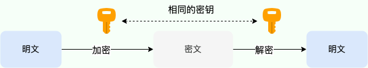
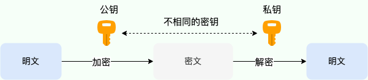
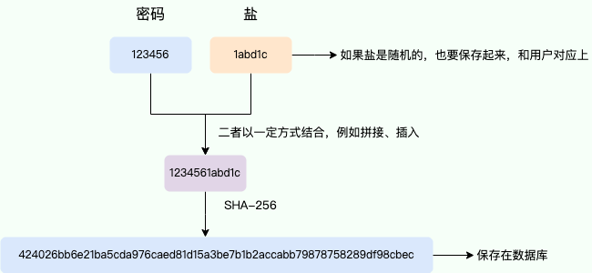
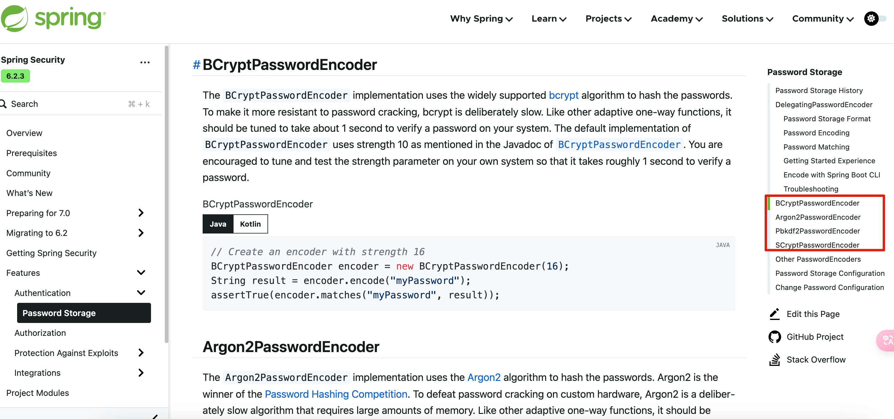
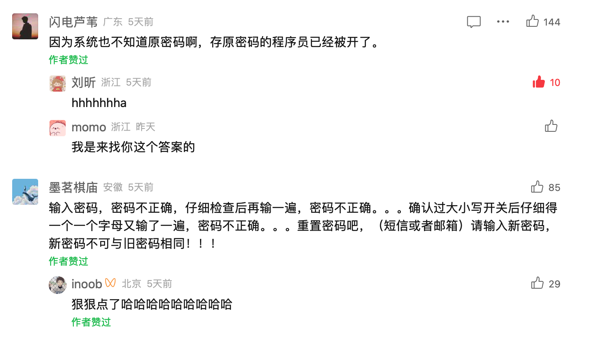
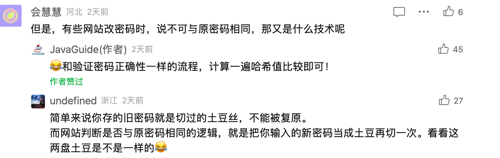

# ⭐如何安全传输和存储密码？

## <font style="color:rgb(44, 62, 80);"></font>密码传输安全

### 使用 HTTPS

HTTPS 协议是首要的。HTTP 协议运行在 TCP 之上，所有传输的内容都是明文，客户端和服务器端都无法验证对方的身份。HTTPS 是运行在 SSL/TLS 之上的 HTTP 协议，SSL/TLS 运行在 TCP 之上。所有传输的内容都经过加密，加密采用对称加密，但对称加密的密钥用服务器方的证书进行了非对称加密。所以说，HTTP 安全性没有 HTTPS 高，但是 HTTPS 比 HTTP 耗费更多服务器资源。

关于 HTTP 和 HTTPS 的详细对比可以看这篇文章：[HTTP vs HTTPS（应用层）](https://javaguide.cn/cs-basics/network/http-vs-https.html)。

不过，仅仅通过 HTTPS 协议还无法保障， HTTPS 的攻击手段也不少，比如降级攻击、中间人攻击等。而且，HTTPS 只能保证传输过程中第三方抓包看到的是密文，防不了客户端截取数据的黑客。因此，我们还需要给用户密码\*\*「加密再传输」\*\* 。

### 密码加密

加密算法有\*\*「对称加密」**和**「非对称加密」\*\*两大类。

对称加密算法是指加密和解密使用同一个密钥的算法，也叫共享密钥加密算法。



非对称加密算法是指加密和解密使用不同的密钥的算法，也叫公开密钥加密算法。这两个密钥互不相同，一个称为公钥，另一个称为私钥。公钥可以公开给任何人使用，私钥则要保密。

如果用公钥加密数据，只能用对应的私钥解密（加密）；如果用私钥加密数据，只能用对应的公钥解密（签名）。这样就可以实现数据的安全传输和身份认证。



常见的非对称加密算法有 RSA、DSA、ECC 等。

对于密码传输这一场景，我们可以使用非对称加密算法。

完整的流程如下：

1. 客户端要传输密码前使用公钥加密密码
2. 服务端获取加密后的密码后用私钥解密获取原始密码

公钥是公共的，所有地方都可以被拿到使用，私钥是绝密的，只能被服务端保密持有。最经典的非对称加密算法是 RSA 算法。

## 密码保存安全

对于密码，绝对不能直接明文存储。一般情况下，我们都是通过哈希算法来加密密码并保存。也就是说，保存密码到数据库时使用哈希算法进行加密，可以通过比较用户输入密码的哈希值和数据库保存的哈希值是否一致，来判断密码是否正确。

哈希算法可以简单分为两类：

1. **加密哈希算法**：安全性较高的哈希算法，它可以提供一定的数据完整性保护和数据防篡改能力，能够抵御一定的攻击手段，安全性相对较高，但性能较差，适用于对安全性要求较高的场景。例如 SHA2、SHA3、SM3、RIPEMD-160、BLAKE2、SipHash 等等。
2. **非加密哈希算法**：安全性相对较低的哈希算法，易受到暴力破解、冲突攻击等攻击手段的影响，但性能较高，适用于对安全性没有要求的业务场景。例如 CRC32、MurMurHash3、SipHash 等等。

除了这两种之外，还有一些特殊的哈希算法，例如安全性更高的**慢哈希算法**。

MD5 是过去很长一段时间常用的哈希算法，其最初是设计用来作为加密目的的哈希算法，但由于其安全性问题，现在通常不被认为是加密哈希算法，也不被推荐使用了。

MD5 存在被破解的风险，攻击者可以通过暴力破解或彩虹表攻击等方式，找到与原始数据相同的哈希值，从而破解数据。为了增加破解难度，通常可以选择加盐。盐（Salt）在密码学中，是指通过在密码任意固定位置插入特定的字符串，让哈希后的结果和使用原始密码的哈希结果不相符，这种过程称之为“加盐”。加盐之后就安全了吗？并不一定，这只是增加了破解难度，不代表无法破解。而且，MD5 算法本身就存在弱碰撞（Collision）问题，即多个不同的输入产生相同的 MD5 值。因此，不建议使用 MD5 加密密码，即使加盐也存在安全风险。

即使到今天，网上依然还有很多教程采用 MD5 + Salt 的方式加密密码，需要重点注意一下！

为了增加安全性，可以使用**安全性较高的加密哈希算法+ Salt（盐）**（例如 SHA2、SHA3、SM3，更高的安全性更强的抗碰撞性）。建议每个用户的 Salt 值不同（最好对不同用户的密码随机生成不同的 Salt，Salt 库和密码库分离开），这样就没办法用彩虹表进行批量破解。

假如我们这里使用  **SHA-256 + Salt** 这种方式，这里来简单那演示一下整个流程。

这里写了一个简单的加密密码的示例代码：

```java
String password = "123456";
String salt = "1abd1c";
// 创建SHA-256摘要对象
MessageDigest messageDigest = MessageDigest.getInstance("SHA-256");
messageDigest.update((password + salt).getBytes());
// 计算哈希值
byte[] result = messageDigest.digest();
// 将哈希值转换为十六进制字符串
String hexString = new HexBinaryAdapter().marshal(result);
System.out.println("Original String: " + password);
System.out.println("SHA-256 Hash: " + hexString.toLowerCase());
```

输出：

```plain
Original String: 123456
SHA-256 Hash: 424026bb6e21ba5cda976caed81d15a3be7b1b2accabb79878758289df98cbec
```

在这个例子中，服务端保存的就是密码“123456”加盐哈希之后的数据，也就是“424026bb6e21ba5cda976caed81d15a3be7b1b2accabb79878758289df98cbec” 。



当你输入密码登录之后，服务端会先把你的密码对应的盐取出，然后再去执行一遍获取哈希值的过程。如果最终计算出来的哈希值和保存在数据库中的哈希值一直，那就说明密码是正确的。否则的话，密码就不是正确的。

不过，这不代表没有破解风险了（利用密码破解硬件，我们可以在一秒钟内进行数十亿次的哈希计算）。

安全性更高的一种方案是使用 **密钥派生算法（Key Derivation Function，简称 KDF，也称为密码哈希算法）**。相比其他加密哈希算法，KDF 具有一个独特属性——计算速度很慢，而且从设计上就使其计算速度难以提升，所以 KDF 也被称为 **慢哈希算法** 。这个慢相比于其带来的安全性来说是可以接受的，毕竟主要也是在登录时执行一次。

常见的 KDF 算法主要有（安全程度依次递增）：

1. PBKDF2：其核心是对 HMAC 进行多次迭代以增加破解难度。Bcrypt 对内存的要求较低，并不能抵抗密码破解硬件（如GPU、ASIC、FPGA）攻击。这个 KDF 算法比较老了，目前已经不推荐使用。
2. Bcrypt：一种基于 Blowfish 加密算法的密码哈希算法，专门为密码加密而设计，安全性高于 PBKDF2。Bcrypt 对内存的要求较低，同样不能抵抗密码破解硬件攻击。
3. Scrypt：相比于 PBKDF2 和 Bcrypt，其占用的内存更多，安全性也要更高。它还可以通过调整内存和CPU的使用量来增加破解的难度。
4. Argon2：目前最强的密码 Hash 算法，在 2015 年赢得了密码 Hash 竞赛。和 Scrypt 一样，Argon2 同样需要大量的内存。二者综合使用加盐、多次迭代、大量消耗 CPU 时间和内存资源等手段，大大提升了对抗密码破解硬件的能力。

Spring Security 提供了这些 KDF 算法的实现（地址：<https://docs.spring.io/spring-security/reference/features/authentication/password-storage.html>）：



对于绝大部分项目来说，个人觉得 Bcrypt就足够了，虽然它的安全性比不上 Scrypt 和 Argon2，但综合起来性价比较高。

这里再单独介绍一下 Bcrypt：Bcrypt 采用了 salt（盐） 和 cost（成本） 两种机制，它可以有效地防止彩虹表攻击和暴力破解攻击，从而保证密码的安全性。加 salt 可以防止彩虹表攻击，也就是说，使用 Bcrypt 加密密码时已经包含了一个随机加盐的过程，不需要额外加盐了。cost 又称为工作因子，定义了哈希计算的复杂度。成本越高，计算所需的时间和资源就越多，这使得暴力破解攻击变得更加困难。实际项目中，可以根据系统的性能和安全需求调整 cost。

Spring Security 提供的`BCryptPasswordEncoder` 工作因子范围在 4-31 ，默认是 10。

```java
	/**
	 * @param strength the log rounds to use, between 4 and 31
	 */
	public BCryptPasswordEncoder(int strength) {
		this(strength, null);
	}
```

看了上面的分享之后，相信你搞懂了另外一个有意思的面试题：“[为什么忘记密码要重置而不是告诉你原密码？](https://mp.weixin.qq.com/s/2jgEs_654GbkGWcBYkLZTQ)”，因为服务端也不知道你的原密码是什么。



那有的朋友又有疑问了，为什么很多网站改密码不可与原密码相同呢？这是过程实际和验证密码正确性一样的流程，计算一遍哈希值比较即可！



### 总结

为了保证密码传输的安全性，建议采用的方案是： **HTTPS + 非对称加密算法**（如 RSA）。为了安全保存密码，建议**加密哈希算法+ Salt**（例如 SHA256，建议每个用户的 Salt 值不同） 或者**慢哈希**（例如 Bcrypt，更推荐这种方式）的方案进行存储。

除此之外，还有下面这些建议：

* 如果用户登录时密码错误，那错误提示语不要直接提示“密码错误”，只需要给出一个大概的提示，比如“用户名或密码错误”；
* 密码错误次数连续超过 N 次，比如 6 次，则将用户锁定一段时间；
* 增加多重校验，比如登录设备检测、指纹识别、人脸识别、手机验证码等。


> 更新: 2026-03-28 13:24:45  
> 原文: <https://www.yuque.com/snailclimb/tangw3/pt0w151wtcal7oaf>