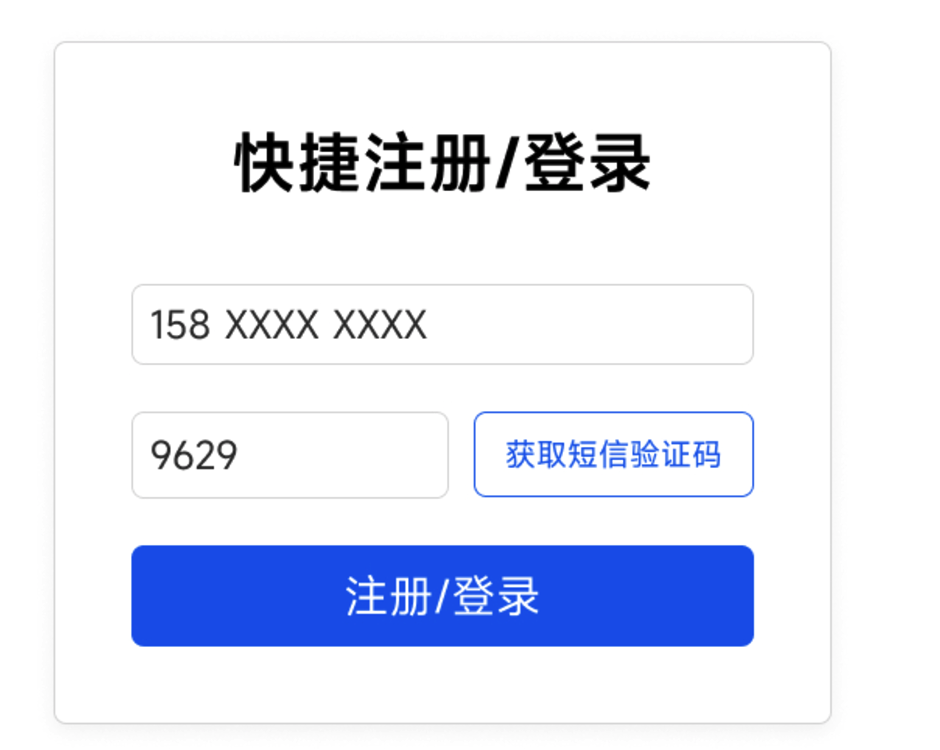

# 验证码登录场景怎么设计？

验证码（Verification Code）是一种常见的安全机制，通常用于验证用户输入、确认用户身份或操作请求的合法性。通过验证码，可以有效防止恶意攻击、批量操作以及非授权操作。

在注册和登录场景下，验证码的作用尤为重要：

* **注册**：通过发送验证码到用户的手机或邮箱，验证用户的身份，确保注册操作是由用户本人发起，同时防止批量注册和恶意账户生成。
* **登录**：某些系统为了提高安全性，采用短信或邮箱验证码作为登录的一部分，例如动态验证码登录或作为双因子验证（2FA）的一环，确保用户的账户安全。



那么，当我们需要设计一个短信验证码登录的场景时，应该怎么做呢？

**短信验证码登录的完整流程如下**：

1. 用户点击“发送验证码”按钮，前端向后端发送请求，包含手机号信息。
2. 后端生成一个随机验证码（通常为 6 位数字）和唯一标识（UUID），并将验证码和 UUID 存储到 Redis 中，以手机号为唯一 Key，覆盖之前的验证码数据。
3. 短信服务商将验证码发送到用户的手机号，同时后端通过 Redis 限制发送频率（如每分钟最多发送一次，每天最多发送 5 次）。
4. 后端将 UUID 返回给前端，前端将 UUID 存储在本地（如 `localStorage` 或 `sessionStorage`，`sessionStorage`存储安全性更高）。
5. 用户收到短信后，输入验证码，前端将手机号、验证码和 UUID 一起提交给后端。
6. 后端使用手机号从 Redis 获取验证码记录，并校验提交的 UUID 和验证码是否匹配：
   * 如果匹配，则验证成功，并立即删除 Redis 中的验证码记录，执行登录流程（如生成 Token）。
   * 如果不匹配，记录错误次数，超过最大错误次数后锁定手机号的验证功能一段时间。
7. 验证成功后，返回登录成功的 Token 或其他相关信息。

**UUID 的作用**：防止验证码泄露被滥用。如果攻击者通过某种方式窃取了验证码（例如短信被拦截或用户截图泄露），那么直接用手机号+验证码可以绕过验证。使用  UUID 作为额外的校验参数，可以增加破解难度，因为攻击者需要同时知道验证码和  UUID 才能通过验证。

**注意**：

1. 更细化的 key设计是这样的：`verification:{类型}:{场景}:{目标}`。`{类型}`：如 `sms`（短信）、`email`（邮箱），`{场景}`：如 `login`（登录）、`register`（注册）。`{目标}`：手机号或邮箱。示例：短信登录验证码：`verification:sms:login:13812345678`，邮箱注册验证码：`verification:email:register:user@example.com`。
2. 除了手机号限制外，还建议对单个 IP 的请求频率进行限制，防止攻击者使用不同的手机号进行短信轰炸。接口防盗刷的详细介绍，可以阅读《Java面试指北》的这篇文章：[高可用：防止接口被盗刷/如何保证接口的安全？](https://www.yuque.com/snailclimb/mf2z3k/pauv7l8rmidckudq)。
3. 我们在后端对验证码发送频率做了限制，不会出现因为网络波动等原因导致用户同时收到多个验证码。

**Redis 数据结构设计**：

```json
{
  "code": "123456",        // 验证码
  "uuid": "uuid-123456",   // 唯一标识
  "errorCount": 0,         // 验证错误次数
  "sendCount": 3           // 当天发送次数
}
```

* `errorCount`：当前验证码验证错误次数。
* `sendCount`：记录当天已发送的验证码次数。可以通过设置单独的 Redis Key（如 `verification:count:{手机号}`）或直接在同一个 Key 中管理。

**前端注意事项**：

1. 按钮置灰：防止用户重复点击，减少无效请求。
2. 验证码前置：填写验证码之后才可以发送短信。
3. 手机号合法性校验：提前校验手机号格式，避免无效请求浪费后端资源。
4. HTTPS 加密传输：通过 HTTPS 加密传输，避免验证码和 UUID 泄露。


> 更新: 2024-12-06 10:32:30  
> 原文: <https://www.yuque.com/snailclimb/tangw3/gxvdwrdl2mcqk1d1>