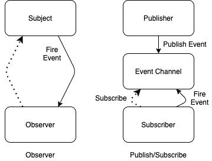
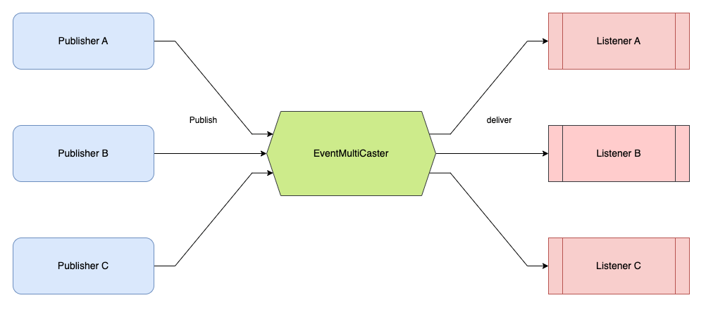
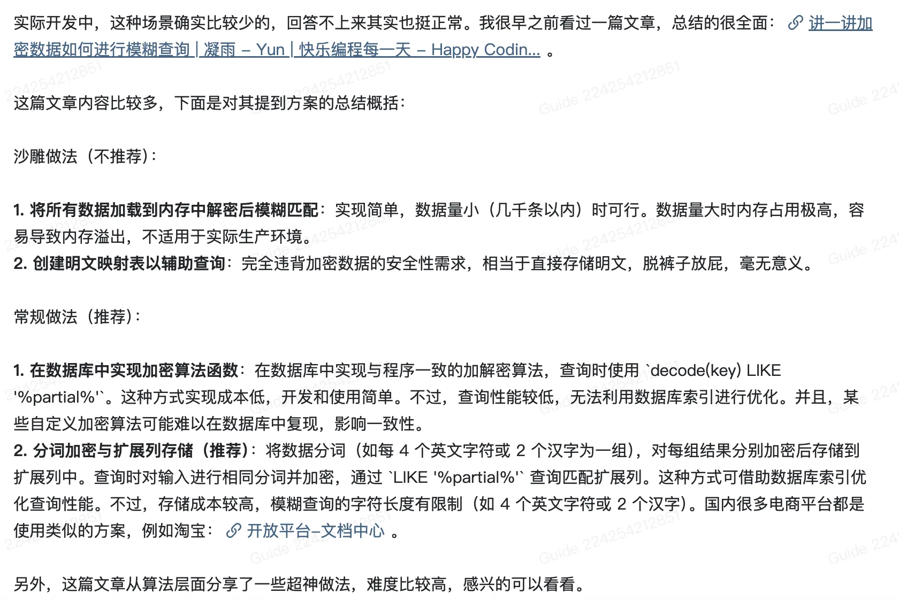
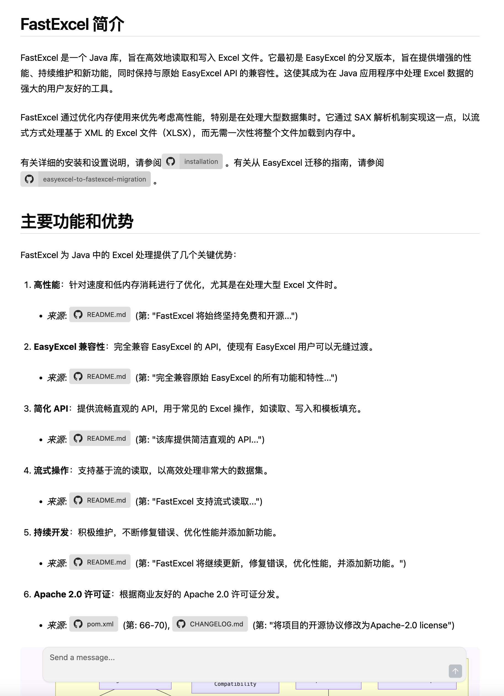

# ⭐几种典型的后端面试场景题（补充）

## <font style="color:rgb(74, 74, 74);">脱敏的规则有很多种</font>一个系统用户登录信息保存在服务器 A 上，服务器 B 如何获取到 Session 信息？
> 对于 Session 的基本概念不了解的同学，可以查看我写的[认证授权基础概念详解](https://javaguide.cn/system-design/security/basis-of-authority-certification.html)这篇文章，里面有详细介绍到。
>

这道问题的本质是在问分布式 Session 共享的解决方案。

正如题目描述的那样，假设一个系统用户登录信息保存在服务器 A 上，该系统用户通过服务器 A 登录之后，需要访问服务器 B 的某个登录的用户才能访问的接口。假设 Session 信息只保存在服务器 A 上，就会导致服务器 B 认为该用户并未登录。因此，我们需要让 Session 信息被所有的服务器都能访问到，也就是 **分布式 Session 共享** 。

常见的分布式 Session 共享的解决方案有下面这几种（这里介绍三种最常见也是比较有代表性的）：

### Session 复制（实际项目中不会采用这种方案）
当用户首次访问一台服务器（比如服务器 A）并创建 Session 后，服务器 A 会把这个 Session 信息**复制**给集群中所有其他服务器。这样，用户后续请求无论落到哪台服务器，都能找到对应的 Session。

+ **优点**：
    - **高可用**：一台服务器挂了，其他服务器上还有 Session 备份，用户登录状态不受影响。
+ **缺点**：
    - **性能差、开销大**：服务器越多，复制带来的网络开销和处理开销就越大，严重影响性能。
    - **内存冗余**：每台服务器都存全量 Session，浪费内存。
    - **数据一致性延迟**：复制需要时间，短时间内可能出现某台服务器 Session 数据不是最新的情况。

### 数据库保存（不推荐）
把 Session 数据统一存到后端的关系型数据库（如 MySQL）中。所有服务器都从这个共享数据库中读取和写入 Session 信息。

+ **优点**：
    - **实现相对简单**：利用现有数据库即可。
    - **数据可靠性高**：数据库通常有完善的数据备份和恢复机制。
+ **缺点**：
    - **性能瓶颈**：数据库的读写性能通常不如专门的缓存，频繁的 Session 操作会给数据库带来巨大压力，容易成为系统瓶颈。
    - **增加数据库负担**：影响核心业务数据的性能。
    - **需要额外管理**：Session 的过期、清理等逻辑可能需要应用层面额外处理。

### 分布式缓存保存（推荐）
将 Session 数据集中存储在像 **Redis** 或 **Memcached** 这样的分布式缓存系统中。所有服务器都通过访问这个共享缓存来获取和更新 Session。

这是目前最广泛使用的方案。

+ **优点**：
    - **高性能**：缓存系统基于内存操作，读写速度非常快，能轻松应对高并发的 Session 访问。
    - **易于水平扩展**：缓存集群（如 Redis Cluster）可以方便地扩展以支持更大的数据量和并发。
    - **相对简单**：很多框架（如 Spring Session）都对这种方式提供了很好的支持，集成方便。
+ **缺点**：
    - **数据可能丢失**：如果缓存服务（如 Redis）宕机且没有配置好持久化或高可用方案（如哨兵、集群），可能会丢失部分 Session 数据，导致用户需要重新登录。不过，通过合理的持久化和集群配置可以大大降低风险。
    - **引入额外依赖**：需要维护一套独立的缓存系统。

## 你知道哪些实现业务解耦的方法（提示：事件驱动）？
这个问题在中大厂面试中还是比较常见的，阿里、字节、美团等公司的面试都有问到过这个问题。

解耦是一种很重要的软件工程原则，它可以提高代码的质量和可复用性，降低系统的耦合度和维护成本。在日常开发中，处处可以看到解耦思想的运用，例如，AOP 可以让我们将横切关注点（如日志、事务、权限控制等）从核心业务逻辑中分离出来，实现关注点的分离。IoC 可以让我们将对象的创建和依赖管理交给容器，实现对象的控制反转。插件架构（也被称为微内核架构）下，通过增加插件即可增强系统功能，非常易于扩展功能，适合做定制化。

实现业务解耦的方法有很多比如事件驱动、协议通信，我们这里重点关注事件驱动这种业务解耦的常见方式。

事件驱动可以让不同的业务组件之间保持松散的耦合，提高系统的可扩展性和灵活性。

事件驱动的实现方式和表现形式有很多种，常用的有以下两种：

**1、基于发布订阅模式的事件驱动**

发布订阅模式下，发布者和订阅者之间没有直接的联系，通过一个中间件（比如 MQ、Redis）来进行消息的传递。

MQ 实现解耦就是这种模式。生产者发布事件（消息）到消息队列，消费者根据自己需要对事件进行消费。并且，一个事件可以被一个或多个消费者消费。

这就是消息队列广泛采用的发布订阅模型。


这种方式在业务解耦的同时，还实现了异步，提高了系统的吞吐量和接口的响应速度。生产者把事件放到消息队列之后就立即返回，随后，消费者再对消息进行消费。

常见的消息队列有 Kafka、RocketMQ、RabbitMQ、Pulsar 等等。成熟的消息队列的功能性比较完善，自带消息持久化、负载均衡、消息高可能等功能。关于这些详细队列的详细对比，可以查看[消息队列基础知识总结](https://javaguide.cn/high-performance/message-queue/message-queue.html)这篇文章。

除了 MQ 之外，还有一些其他的中间件可以实现基于发布订阅模式的事件驱动，比如 Redis 中的 **发布订阅 (pub/sub) 功能**  （Redis 2.0 引入的）。


Redis 的 pub/sub 涉及发布者（Publisher）和订阅者（Subscriber，也叫消费者）两个角色：

+ 发布者通过 `PUBLISH` 投递消息给指定 channel。
+ 订阅者通过`SUBSCRIBE`订阅它关心的 channel。并且，订阅者可以订阅一个或者多个 channel。

和消息队列很类似，本质其实还是消息队列。不过，这种方式存在消息丢失（客户端断开连接或者 Redis 宕机都会导致消息丢失）、消息堆积（发布者发布消息的时候不会管消费者的具体消费能力如何）等问题不好解决。

再多提一嘴，Redis 5.0 新增加的一个数据结构 `Stream` 来做消息队列。`Stream` 支持：

+ 发布 / 订阅模式
+ 按照消费者组进行消费
+ 消息持久化（ RDB 和 AOF）

不过，和专业的消息队列相比，使用 Redis 来实现消息队列还是有很多欠缺的地方比如消息丢失和堆积问题不好解决。因此，我们通常建议不要使用 Redis 来做消息队列。

**2、基于观察者模式的事件驱动**

观察者模式下，不存在中间件这个角色。观察者模式抽象出了一个 Subject（被观察者），用于维护观察者列表，并在自身状态发生变化时通知所有的观察者。

观察者模式和发布订阅模式的简单对比如下（后面会进行详细对比）：



可以看到，发布订阅模式其实就是在观察者模式的基础上多了一个中间件（也就是图中的事件通道）。

常见的基于观察者模式的事件驱动框架有 Spring Event、Guava EventBus 等。

网上有很多文章说 Spring Event 和 Guava EventBus 是发布订阅模式，其实也没问题，大部分人应该都是这样认为。这个真不需要太纠结，毕竟二者在表现形式上确实是发布订阅形式。

```java
// 事件发布者
@Component
public class CustomSpringEventPublisher {
    @Autowired
    private ApplicationEventPublisher applicationEventPublisher;

    public void publishCustomEvent(final String message) {
        System.out.println("Publishing custom event. ");
        CustomSpringEvent customSpringEvent = new CustomSpringEvent(this, message);
        applicationEventPublisher.publishEvent(customSpringEvent);
    }
}

// 事件监听者
@Component
public class CustomSpringEventListener implements ApplicationListener<CustomSpringEvent> {
    @Override
    public void onApplicationEvent(CustomSpringEvent event) {
        System.out.println("Received spring custom event - " + event.getMessage());
    }
}
```

但如果你认可观察者模式和发布订阅模式是有区别的话，那说二者是基于观察者模式更合适一些。你可以将 Spring Event 中的 EventMultiCaster，Guava EventBus 中的 EventBus 看作是 Subject 的一部分，用于维护观察者，并在自身状态发生变化时通知所有的观察者。 Spring Event 和 Guava EventBus 只是没有显示地维护观察者和被观察者的关系罢了，实际上还是维护了，直接交互了。




Guava 官网对 EventBus 的描述是这样的（ 文档地址 ：[https://github.com/google/guava/wiki/EventBusExplained](https://github.com/google/guava/wiki/EventBusExplained) ）：

> `EventBus` allows publish-subscribe-style communication between components without requiring the components to explicitly register with one another (and thus be aware of each other). It is designed exclusively to replace traditional Java in-process event distribution using explicit registration. It is _not_ a general-purpose publish-subscribe system, nor is it intended for interprocess communication.
>
> `EventBus`允许组件之间进行发布-订阅式通信，而不需要组件显式地相互注册（从而了解彼此）。它专门设计用于替代使用显式注册的传统 Java 进程内事件分发。它不是通用的发布-订阅系统，也不是用于进程间通信。
>

Spring Event 和 Guava EventBus 默认是同步的，但也能实现异步，只是功能比较鸡肋。

Java 中实现观察者模式的两种方法是：

1. 使用 Java API 中提供的 `java.util.Observable` 类和 `java.util.Observer` 接口(Java 9 中已废弃) 。
2. 使用 Java Beans 中提供的 `java.beans.PropertyChangeListener` 接口和 `java.beans.PropertyChangeSupport` 类。

下面我们来简单对比一下发布订阅模式和观察者模式

发布订阅模式和观察者模式是两种常见的行为型设计模式，都可以用来实现业务解耦，有一些文章或者书籍直接把观察者模式称为发布订阅模式。在我看来，两者虽然思想一致，但还是存在一些区别的，适用场景也不同。

+ 发布订阅模式中，发布者和订阅者是完全解耦的，它们之间不直接交互，通过中间件进行消息传递。而观察者模式中，需要维护观察者信息，被观察者（Subject）和观察者是直接交互的。
+ 发布订阅模式可以利用中间件（比如 MQ、Redis）来实现分布式的消息传递，可以用于跨应用或跨进程的场景。而观察者模式直接基于对象本身的数据变化来进行通信，无法用于跨应用或跨进程的场景。
+ 观察者模式大多数时候是同步的，而发布订阅模式大多数时候是异步的。观察者模式中，当被观察者发生变化时，它会立即通知所有的观察者。发布-订阅模式中，发布者和订阅者之间没有直接的联系，通过一个中间件（比如 MQ、Redis）来进行消息的传递，发布者发布消息到中间件即可，消费者再通过中间件进行消费。

[观察者模式 vs 发布-订阅模式](https://mp.weixin.qq.com/s/FPdR51uTRC6f_XEkea9YiA) 这篇文章介绍的还挺不错的，如果你还是不理解的话，可以看看。

## 如何实现扫码登录？
参考答案：

+ [聊聊二维码扫码登录的原理](https://mp.weixin.qq.com/s/odkqiHVnzHXKZuHQRNnWug)
+ [聊一聊二维码扫描登录原理](https://juejin.im/entry/5e83e7ae51882573ba2074c8)

## 如何不通过压测预估项目的 QPS？
常见的性能测试工具，我们应该都不陌生了：

1. Jmeter：Apache JMeter 是 JAVA 开发的性能测试工具。
2. LoadRunner：一款商业的性能测试工具。
3. Galtling：一款基于 Scala 开发的高性能服务器性能测试工具。
4. ab：全称为 Apache Bench 。Apache 旗下的一款测试工具，非常实用。

这个问题问的考察点在于，我们如何不利用这些工具来预估项目的 QPS。

一种常用的办法是，根据你的项目的日活跃用户数（DAU）来估算 QPS。这种方式比较简单，但需要项目有一定的用户数据和行为分析经验作为支撑。

假设我们的系统有 100 万的日活跃用户，每个用户日均发送 10 次请求。这样的话，总请求量为 1000 万，均值 QPS 为 1000 万 / (24 _ 60 _ 60) ≈ 116。但用户的访问也符合局部性原理，通常我们可以认为 20% 的时间集中了 80% 的活跃用户访问，也就是说峰值时间占总时间的 20%。那么，峰值时间的 QPS 为 1000 万 _ 0.8 / (24 _ 60 _ 60 _ 0.2) ≈ 463 。

这里预估的 QPS 如果遇到像秒杀活动、限时抢购这种特殊的场景，还需要在峰值时间的 QPS 的基础上再乘以 5 或者其他合适的倍数。

另外，由于没有考虑请求的复杂度和服务器的性能，我们可以在计算得出的 QPS 基础上，根据项目实际情况去进一步预估 QPS。

## 数据加密之后，如何模糊查询？
参考答案：[https://t.zsxq.com/K2rQS](https://t.zsxq.com/K2rQS) 。




## 大量 Excel 导出时出现 OOM 问题，如何解决？
Excel 导出时发生 OOM (Out Of Memory) 是个常见问题，尤其当数据量非常大的时候。根本原因在于，很多传统的 Excel 操作库会尝试**一次性把所有数据加载到内存中**来构建 Excel 文件，数据一大，内存自然就爆了。

**解决这个问题的核心思路是避免全量数据驻留内存，采用流式处理或者分批处理的方式。**

EasyExcel 是阿里巴巴开源的一个优秀 Java Excel 处理框架，它的核心设计理念就是为了解决 OOM 问题。它采用**“边读边写”的流式处理机制**，逐行读取数据并写入到输出流，内存占用极低，非常适合大数据量的导出。[FastExcel](https://github.com/fast-excel/fastexcel) 可以看作是 EasyExcel 的升级版或增强版，由原作者在 EasyExcel 停止积极维护后推出，继承了其优点并在性能和功能上有所提升。



如果你因为历史项目原因或者其他特定需求必须使用 Apache POI，那么一定要用它提供的 **SXSSFWorkbook (Streaming Usermodel API)** 。SXSSFWorkbook 允许你定义一个“内存窗口大小”（比如，只在内存中保留最近的 100 行数据）。当写入的行数超过这个窗口时，最早的行数据会被自动刷新（flush）到磁盘上的一个临时文件中，从而释放内存。最后，这些临时文件会被整合成最终的 Excel 文件。

**其他建议**：

+ **分页查询导出**：不要一次性从数据库查询所有数据。可以分页查询，每次处理一小批数据，然后通过流式库写入 Excel。这可以显著降低数据库压力和应用服务器的瞬时内存占用。
+ **按需导出字段**：只导出用户真正需要的列，避免导出不必要的宽表数据，减少数据量。
+ **异步导出与任务队列**：对于非常大的数据导出，可以将其设计成一个异步任务。用户提交导出请求后，后端将任务放入消息队列（如 Kafka, RabbitMQ），由专门的 worker 服务异步处理导出，完成后再通知用户下载。这样可以避免长时间占用 HTTP 连接，提升用户体验，并且更利于资源控制。


> 更新: 2025-10-29 20:34:14  
> 原文: <https://www.yuque.com/snailclimb/tangw3/dq1bxf73l9xo1xdk>