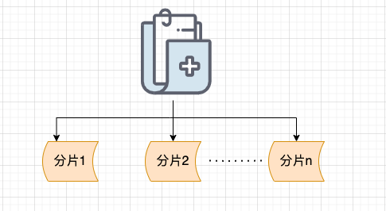
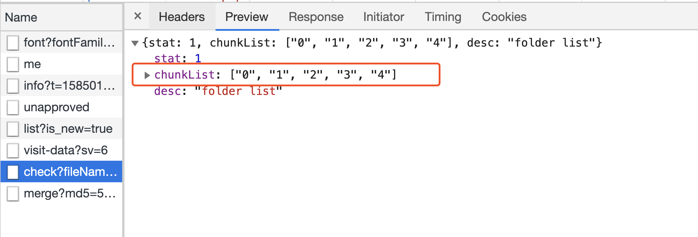
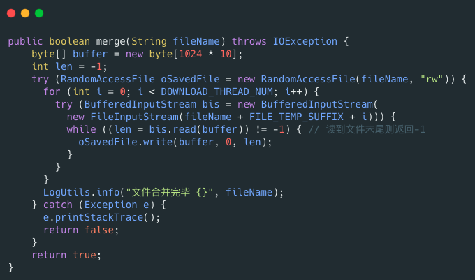

# ⭐如何解决大文件上传问题？

如果你的项目涉及到文件上传的话，面试官很可能会问你这个问题。

我们先看第一个场景：**大文件上传中途，突然失败！**

试想一个，你想上传一个 5g 的视频，上传进度到 99% 的时候，特么的，突然网络断了，这个时候，你发现自己竟然需要重新上传。我就问你抓狂不？

**有没有解决办法呢？** 答案就是：**分片上传！**

***

## 什么是分片上传？有什么好处？

简单来说，我们只需要先将文件切分成多个文件分片（就像我下面绘制的图片所展示的那样），然后再上传这些小的文件分片。

前端发送了所有文件分片之后，服务端再将这些文件分片进行合并即可，这样就得到的一个完整的文件。

分片上传的原理就是这样的，非常简单，就是分治思想的运用。

别看原理这么简单，分片上传的好处还是很多的，主要体现在以下两点：

1. **断点续传** ：上传文件中途暂停或失败（比如遇到网络问题、手动暂停）之后，不需要重新上传，只需要上传那些未成功上传的文件分片即可。所以，分片上传是断点续传的基础。
2. **多线程上传** ：我们可以通过多线程同时对一个文件的多个文件分片进行上传，这样的话就大大加快的文件上传的速度。

## 分片上传的流程是什么？

分片上传的大致流程如下：

1. 检查一下文件的格式、大小等等信息并根据文件信息生成文件的唯一标识（如 SHA-256）。
2. 将需要上传的文件按照一定的分割规则，分割成相同大小的分片，例如将一个 100MB 的文件切割成相等大小的 5 份，每份 20MB；
3. 初始化一个分片上传任务，返回本次分片上传的唯一标识（后续可以通过该唯一标识定位该次分片上传任务，可实现手动暂停和开始上传）；
4. 每个分片在发送前，客户端会计算其哈希值（如 SHA-256），并将这个哈希值与分片一起发送给服务器；
5. 按照一定的策略（串行或并行）发送各个分片；
6. 服务器接收到分片后，会重新计算分片的哈希值，并与客户端发送的哈希值进行比对；
7. 如果哈希值匹配，则认为该分片有效，服务器会存储该分片并等待其他分片的到来；如果哈希值不匹配，则认为该分片无效，说明该文件此次上传之前可能被修改过；
8. 所有分片发送完成后，服务端会进行分片的合成，以得到原始文件。
9. 再计算合并后的原始文件的唯一标识，与客户端发送的唯一标识进行对比，一致则说明此次文件上传没问题。

\*\*文件的唯一标识如何生成呢？\*\*一般情况下，文件的这个唯一标识可以通过对文件的大小、名称、最后修改时间等信息取 MD5 值得到的。不过，MD 算法已经不被推荐使用，建议使用更安全的哈希算法比如 SHA-2（包括 SHA-224、SHA-256、SHA-384、SHA-512 等等），可减少哈希碰撞，更加安全。分片的哈希值的计算规则也是类似的。

**前端怎么生成文件分片呢？后端如何合并文件分片呢？**

前端可以通过 <code>**Blob.slice()**</code> 方法来对文件进行切割（`File` 对象是继承 `Blob` 对象的，因此 `File` 对象也有 `slice()` 方法）。

生成文件切片的示例代码如下：

<code>**RandomAccessFile**</code> 类可以帮助我们合并文件分片，示例代码如下：

## **什么是秒传？**

秒传说的就是我们在上传某个文件的时候，首先根据文件的唯一标识判断一下服务端是否已经上传过该文件，如果上传过的话，直接就返回给用户文件上传成功即可。

文件的唯一标识计算方法上面在介绍断点续传的时候已经提到了。如果实现了断点续传，那秒传功能实现起来就非常简单了！

需要注意的是：你不能根据文件名就决定文件是否已经上传到服务端，因为很可能存在文件名相同，但是，内容不同的情况。另外，体验更好的是文件内容不变，唯一标识就不应该改变。因此，我们可以根据文件的内容来计算唯一标识。

我简单画了一张图描述一下断点续传和秒传。

相关阅读：

* [大规格文件的上传优化](https://juejin.cn/post/6844904155086061576)
* [一个 Java 实现的，多线程，断点续传下载器](https://github.com/niumoo/down-bit)

> 更新: 2026-02-13 07:31:20  
> 原文: <https://www.yuque.com/snailclimb/tangw3/hnkifck1z5erisgc>