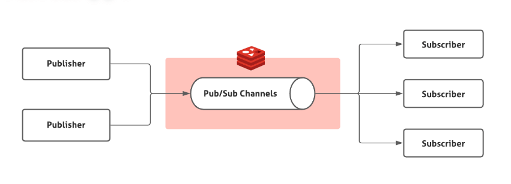
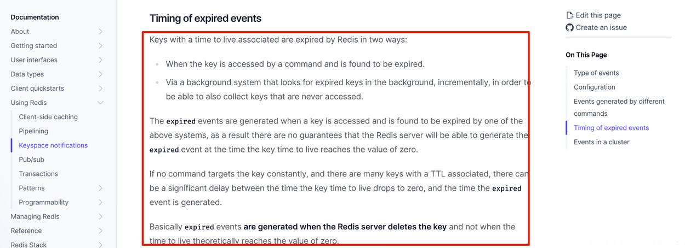
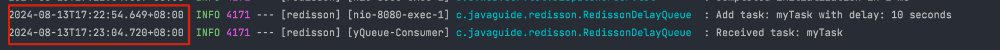

# 如何基于 Redis 实现延时任务？

> 类似的问题：
>
> * 订单在 10 分钟后未支付就失效，如何用 Redis 实现？
> * 红包 24 小时未被查收自动退还，如何用 Redis 实现？

星球里很多球友的项目都是基于 Redis 实现的延时任务，因此单独除了一篇文章详细介绍，避免面试被拷打相关的问题时回答不上来。

Redis 是可以用来做延时任务的，基于 Redis 实现延时任务的功能无非就下面两种方案：

1. Redis 过期事件监听
2. Redisson 内置的延时队列

面试的时候，你可以先说自己考虑了这两种方案，但最后发现 Redis 过期事件监听这种方案存在很多问题，因此你最终选择了 Redisson 内置的 DelayedQueue 这种方案。

这个时候面试官可能会追问你一些相关的问题，我们后面会提到，提前准备就好了。

另外，除了下面介绍到的这些问题之外，Redis 相关的常见问题建议你都复习一遍，不排除面试官会顺带问你一些 Redis 的其他问题。

### Redis 过期事件监听实现延时任务功能的原理？

Redis 2.0 引入了发布订阅 (pub/sub) 功能。在 pub/sub 中，引入了一个叫做 **channel（频道）** 的概念，有点类似于消息队列中的 **topic（主题）**。

pub/sub 涉及发布者（publisher）和订阅者（subscriber，也叫消费者）两个角色：

* 发布者通过 `PUBLISH` 投递消息给指定 channel。
* 订阅者通过`SUBSCRIBE`订阅它关心的 channel。并且，订阅者可以订阅一个或者多个 channel。



在 pub/sub 模式下，生产者需要指定消息发送到哪个 channel 中，而消费者则订阅对应的 channel 以获取消息。

Redis 中有很多默认的 channel，这些 channel 是由 Redis 本身向它们发送消息的，而不是我们自己编写的代码。其中，`__keyevent@0__:expired` 就是一个默认的 channel，负责监听 key 的过期事件。也就是说，当一个 key 过期之后，Redis 会发布一个 key 过期的事件到`__keyevent@<db>__:expired`这个 channel 中。

我们只需要监听这个 channel，就可以拿到过期的 key 的消息，进而实现了延时任务功能。

这个功能被 Redis 官方称为 **keyspace notifications** ，作用是实时监控实时监控 Redis 键和值的变化。

### Redis 过期事件监听实现延时任务功能有什么缺陷？

**1、时效性差**

官方文档的一段介绍解释了时效性差的原因，地址：<https://redis.io/docs/manual/keyspace-notifications/#timing-of-expired-events> 。



这段话的核心是：过期事件消息是在 Redis 服务器删除 key 时发布的，而不是一个 key 过期之后就会就会直接发布。

我们知道常用的过期数据的删除策略就两个：

1. **惰性删除**：只会在取出 key 的时候才对数据进行过期检查。这样对 CPU 最友好，但是可能会造成太多过期 key 没有被删除。
2. **定期删除**：每隔一段时间抽取一批 key 执行删除过期 key 操作。并且，Redis 底层会通过限制删除操作执行的时长和频率来减少删除操作对 CPU 时间的影响。

定期删除对内存更加友好，惰性删除对 CPU 更加友好。两者各有千秋，所以 Redis 采用的是 **定期删除+惰性/懒汉式删除** 。

因此，就会存在我设置了 key 的过期时间，但到了指定时间 key 还未被删除，进而没有发布过期事件的情况。

**2、丢消息**

Redis 的 pub/sub 模式中的消息并不支持持久化，这与消息队列不同。在 Redis 的 pub/sub 模式中，发布者将消息发送给指定的频道，订阅者监听相应的频道以接收消息。当没有订阅者时，消息会被直接丢弃，在 Redis 中不会存储该消息。

**3、多服务实例下存在消息重复消息的问题**

Redis 的 pub/sub 模式目前只有广播模式，这意味着当生产者向特定频道发布一条消息时，所有订阅相关频道的消费者都能够收到该消息。

这个时候，我们需要注意多个服务实例重复处理消息的问题，这会增加代码开发量和维护难度。

### 如何使用 Redisson 实现延迟队列？

这里只是演示一下 Redisson 延迟队列的实际使用，方便大家理解其核心原理，实际面试中一般不会问这么细致。

1、引入 Redisson 依赖：

```xml
<dependency>
    <groupId>org.redisson</groupId>

    <artifactId>redisson-spring-boot-starter</artifactId>

    <version>3.16.2</version>

</dependency>

```

2、创建 Redisson 配置类:

```java
@Configuration
public class RedissonConfig {

    @Bean
    public RedissonClient redissonClient() {
        Config config = new Config();
        config.useSingleServer().setAddress("redis://localhost:6379");
        return Redisson.create(config);
    }
}
```

3、封装了一个延迟队列类 `RedissonDelayQueue`

```java
@Component
public class RedissonDelayQueue {

    private static final Logger log = LoggerFactory.getLogger(RedissonDelayQueue.class);

    @Autowired
    private RedissonClient redissonClient;
    // 延迟队列
    private RDelayedQueue<String> delayQueue;
    // 阻塞队列
    private RBlockingQueue<String> blockingQueue;

    private ExecutorService executorService;

    public RedissonDelayQueue() {
        this.executorService = new ThreadPoolExecutor(
                5,
                10,
                0L, TimeUnit.MILLISECONDS,
                new java.util.concurrent.LinkedBlockingQueue<>(),
                new CustomThreadFactory()
        );
    }

    @PostConstruct
    public void init() {
        blockingQueue = redissonClient.getBlockingQueue("myQueue");
        delayQueue = redissonClient.getDelayedQueue(blockingQueue);
        startConsumer();
    }

    private void startConsumer() {
        executorService.submit(() -> {
            while (!Thread.currentThread().isInterrupted()) {
                try {
                    // 从阻塞队列中获取任务
                    String task = blockingQueue.take();
                    log.info("Received task: {}", task);
                } catch (InterruptedException e) {
                    Thread.currentThread().interrupt();
                    break;
                } catch (Exception e) {
                    log.error("Error processing task", e);
                }
            }
        });
    }

    public void addTask(String task, long delay) {
        log.info("Add task: {} with delay: {} seconds", task, delay);
        // 将任务添加到延迟队列
        delayQueue.offer(task, delay, TimeUnit.SECONDS);
    }

    private static class CustomThreadFactory implements ThreadFactory {
        @Override
        public Thread newThread(Runnable r) {
            Thread thread = new Thread(r, "DelayQueue-Consumer");
            thread.setDaemon(true);
            return thread;
        }
    }
}
```

`RedissonDelayQueue` 中的两个核心方法：

* `startConsumer（）`：启动一个消费者线程，从阻塞队列 `blockingQueue` 中获取任务并处理。
* `addTask(String task, long delay)`：将一个任务添加到延迟队列中，并指定延迟时间。

4、编一个 `Controller` 测试一下：

```java
@RestController
public class TaskController {

    @Autowired
    private RedissonDelayQueue redissonDelayQueue;

    @PostMapping("/addTask")
    public String addTask(@RequestParam String task, @RequestParam long delay) {
        redissonDelayQueue.addTask(task, delay);
        return "Task added with delay: " + delay + " seconds.";
    }
}
```

使用 curl 命令发送 POST 请求：

```bash
# task=myTask：指定任务名称为 myTask。
# delay=10：指定延迟时间为 10 秒。
curl -X POST "http://localhost:8080/addTask" -d "task=myTask&delay=10"
```

控制台输出结果如下：



可以看到，确实是延迟 10s 之后成功获取到了任务。

### 为什么最后选择 Redisson 内置的延时队列来实现延时任务？

Redisson 是一个开源的 Java 语言 Redis 客户端，提供了很多开箱即用的功能，比如多种分布式锁的实现、延时队列。

我们可以借助 Redisson 内置的延时队列 `RDelayedQueue` 来实现延时任务功能。

Redisson 的延迟队列 `RDelayedQueue` 是基于 Redis 的 `SortedSet ` 来实现的。`SortedSet ` 是一个有序集合，其中的每个元素都可以设置一个分数，代表该元素的权重。Redisson 利用这一特性，将需要延迟执行的任务插入到 `SortedSet ` 中，并给它们设置相应的过期时间作为分数。

Redisson 在客户端（即应用程序进程）中启动一个定时任务，到时间后使用 `zrangebyscore` 命令扫描 `SortedSet ` 中过期的元素（即分数小于或等于当前时间的元素），然后将这些过期元素从 `SortedSet ` 中移除，并将它们加入到就绪消息列表（ `List` 结构）中。

当任务被移到实际的就绪消息列表中时，Redisson 通常还会通过发布/订阅机制（Redis 的 `Pub/Sub` 模型）来通知消费者有新任务到达。

就绪消息列表是一个阻塞队列，消费者可以使用阻塞操作（如 `BLPOP key 0`，`0` 表示无限等待，直到有消息进入队列）监听。由于 Redis 的 `Pub/Sub` 机制是事件驱动的，它避免了轮询开销，只有在有新消息时才会触发处理逻辑。

⚠️ 注意：Redisson 的定时任务调度器并不是以固定的时间间隔频繁调用 `zrangebyscore` 命令进行扫描，而是根据 `SortedSet` 中最近的到期时间来动态调整下一次检查的时间点。

实际面试中被问到 Redisson 延时队列原理，能够把前面提到的大概说一下基本就可以。如果想要进一步了解底层源码，推荐看看这篇：[Redisson源码（二）延迟队列 RDelayedQueue 的使用及原理分析](https://cloud.tencent.com/developer/article/2393347)。

相比于 Redis 过期事件监听实现延时任务功能，这种方式具备下面这些优势：

1. **减少了丢消息的可能**：`DelayedQueue` 中的消息会被持久化，即使 Redis 宕机了，根据持久化机制，也只可能丢失一点消息，影响不大。当然了，你也可以使用扫描数据库的方法作为补偿机制。
2. **消息不存在重复消费问题**：每个客户端都是从同一个目标队列中获取任务的，不存在重复消费的问题。

跟 Redisson 内置的延时队列相比，消息队列可以通过保障消息消费的可靠性、控制消息生产者和消费者的数量等手段来实现更高的吞吐量和更强的可靠性，实际项目中首选使用消息队列的延时消息这种方案。

### 使用 Redis 实现延时任务有什么注意的地方？

任务时间跨度大、任务较多的场景建议特殊处理，任务数量较多会导致内存吃不消，时间跨度太大，任务就会一直保存在内存中占用内存，造成资源浪费。

可以结合 MySQL 存储和定时扫描数据库的方式来优化：

* 延迟时间较短的任务（例如几分钟到几个小时内执行的任务）依然可以存储在 Redis 中。延迟时间较长的任务（例如几天或几周后执行的任务）存储在 MySQL 中。
* 通过定时任务（例如 XXL-JOB、Spring Task）定期（如每 15 分钟或 30 分钟）扫描 MySQL 中即将到期的任务（例如在未来 2 小时内到期的任务）并推送到 Redis 中。

定时扫描 MySQL 时，可能会涉及大量数据的查询和处理，需要注意优化查询效率，例如添加索引、分库分表等等。

最后，简单总结一下将 Redis 和 MySQL 结合使用来处理大时间跨度的延时任务的好处：

1. **节省缓存资源**: 避免了因为存储大量长期任务而导致的内存浪费。
2. **可靠性和成本**: MySQL 通过事务机制保证任务数据的可靠性，成本也更低。

如果只使用一个 `RDelayedQueue` 的话，任务数量太大的情况下就会产生大 key 。大 key 的影响就不多说了，具体可以看看 JavaGuide 的这篇文章：[Redis常见面试题总结(下)](https://javaguide.cn/database/redis/redis-questions-02.html)，里面有详细介绍。

如何解决大 key 问题呢?可以将任务按某种逻辑（例如时间段、任务类型）分片存储到多个 `RDelayedQueue` 中，这样就可以避免产生大 key 了。

### 为什么不选择 MQ 实现延时任务？

在我的项目中，由于没有其他场景需要使用消息队列，因此不想为了单一的延时任务场景引入消息队列。引入 MQ 会增加系统的复杂性，需要维护额外的组件和配置，还会增加成本，这是不太可取的。

如果项目将来确实有需要引入 MQ 的场景且 Redis 延时任务确实不再满足项目需求，我会考虑将延时任务的实现平滑迁移到 MQ 上。

在下面这篇文章中有详细提到 MQ 延时任务解决方案，推荐看看：

[订单超时自动取消如何实现？](https://www.yuque.com/snailclimb/tangw3/sgageiesw7cqi1o7)


> 更新: 2024-08-16 15:07:04  
> 原文: <https://www.yuque.com/snailclimb/tangw3/dq6dco1estpldhv7>